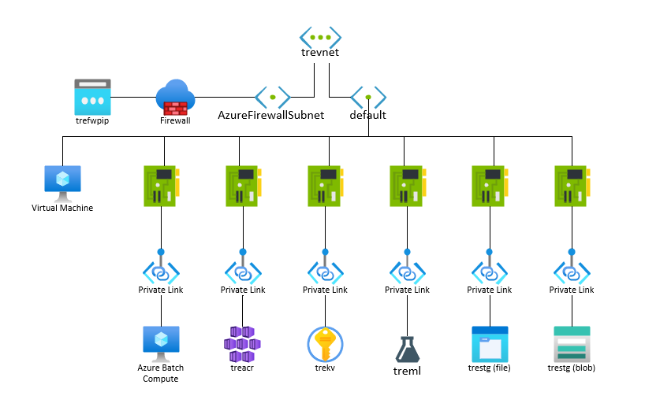

# InnerEye deployment to AzureML (AML) configuration options and requirements for closed VNet setup

## Research

With some limitations listed below, we were able to successfully perform the following tasks:

- Provision AML in a closed VNet with Private Links to all resources
- Provision compute without a public IP and train a InnerEye HelloWorld model
- Install InnerEye and InnerEye Inference per the InnerEye install instructions



### Pre-Requisites
- Brew: https://docs.brew.sh/Installation
- brew install terraform
- brew install azure-cli
- az login
- az account set --subscription <subscription>
- brew install jq


### Setup

A Terraform script [main.tf](./main.tf) creates all the resources described in the above architecture diagram. To setup the full environment:

- Clone the repository locally and rename [terraform.tfvars.tmpl](./terraform.tfvars.tmpl) file to terraform.tfvars
- Adjust the variables as needed. The only variable that must be adjusted is the environment name, as it is the unique part of resource names. If you do not have existing VNETs in your subscription, leave all the other variables as is.
- Run [deploy.sh](./deploy.sh). This script will run:
  - ```terraform init```
  - ```terraform apply```
  - ```terraform output``` - this will output all the variables needed for the next step
  - ```az deployment group create```  this will deploy one Azure ML Compute Instance and one Azure ML Compute Cluster with no public IP using the output parameters from terraform. Since the no-PIP compute is currently in private preview (6th of April, 2021), no Terraform module exists for it, so it is deployed via ARM template. Notice that the subscription must be whitelisted for the deployment to succeed.
  - ```az role assignment``` will add a system identity to the compute cluster and give it permissions to Azure Container Registry
  - ```git clone inference``` will clone the latest version of inference service from GitHub
  - ```cat env_file``` will generate a set_environment.sh environment file used by the inference service
  - ```az webapp up``` will upload the contents of the InnerEye-Inference directory to the webapp created by the terraform

### Testing the deployment

The script will deploy a DSVM Windows 2019 server into the VNET and expose its RDP port through the firewall. Use the username and password provided in the tfvars file and an IP address of the firewall to connect to the jumpbox DSVM. The IP address of the firewall is outputted as part of the terraforms output. From the jumpbox, open a browser and navigate to ml.azure.com; you should be able to access the locked-down environment. Otherwise, the jumpbox will have a very restricted internet access.

### Running the InnerEye HelloWorld on AML Compute Cluster

On the DSVM open PowerShell and run:

- ```git clone https://github.com/microsoft/InnerEye-DeepLearning```
- ```cd InnerEye-DeepLearning```
- ```git lfs install```
- ```git lfs pull```
- ```conda init```
- ```conda env create --file environment.yml```
- Restart PowerShell and navigate to the "InnerEye-DeepLearning" folder
- ```conda activate InnerEye```
- Open Azure Storage Explorer and connect to your Storage Account using name and access key
- On the storage account create a container with name ```datasets``` and a folder named ```hello_world```
- Copy ```dataset.csv``` file from Tests/ML/test_data/dataset.csv to the "hello_world" folder
- Copy the whole ```train_and_test_data``` folder from Test/ML/test_data/train_and_test_data to the "hello_world" folder
- Update the following variables in ```InnerEye/settings.yml```: subscription_id, resource_group, workspace_name, cluster (see [AML setup](https://github.com/microsoft/InnerEye-DeepLearning/blob/main/docs/setting_up_aml.md) for more details).
- Open your browser to ml.azure.com, login, select the right Subscription and AML workspace and then navigate to "Datastores". Create a New datastore named "innereyedatasets" and link it to your storage account and datasets container.
- Back from PowerShell run ```python InnerEye/ML/runner.py --model=HelloWorld --azureml=True```
- The runner will provide you with a link and ask you to open it to login. Copy the link and open it in browser (Edge) on the DSVM and login. The run will continue after login.
- In your browser navigate to ml.azure.com and open the "Experiments" tab to follow the progress of the training

### Configuring and testing inference service

The terraform script will provision an App Service Plan and an App Service for hosting the inference webapp. The webapp will be integrated into a "inference" subnet, allowing the webapp to connect to AML workspace in "default" subnet. Following the setup you will need to:

- Create a new container in your storage account for storing inference images called "inferencetestimagestore".
- Create a new folder in that container called "temp-image-store".
- Navigate to the ml.azure.com, "Datastores" and create a new datastore named "inferencetestimagestore" and connect it to the newly created container.
- The pass key used for authentication is a GUID created during the deployment. You can find this in the output of the deploy.sh script or in the set_environment.sh file (CUSTOMCONNSTR_API_AUTH_SECRET).
- Test the service by sending a GET or POST command using curl or Invoke-WebRequest:
  - Simple ping: ```Invoke-WebRequest https://yourservicename.azurewebsites.net/v1/ping -Headers @{'Accept' = 'application/json'; 'API_AUTH_SECRET' = 'your-guid-secret-1234-1123445'}```
  - Test connection with AML: ```Invoke-WebRequest https://yourservicename.azurewebsites.net/v1/model/start/HelloWorld:1 -Method POST -Headers @{'Accept' = 'application/json'; 'API_AUTH_SECRET' = 'your-guid-secret-1234-1123445'}```

### URLs open for Azure ML

The following URLs need to be opened

Azure ML front page:

- ml.azure.com

For portal login:

- graph.windows.net
- login.microsoftonline.com
- aadcdn.msftauth.net

For AAD access to workspace:

- graph.microsoft.com
- management.azure.com

For workspace access:

- privatelink.api.azureml.ms

For resources used with AzureML (only on own private link):

- privatelink.file.core.windows.net
- privatelink.vaultcore.azure.net
- privatelink.notebooks.azure.net
- privatelink.azurecr.io
- privatelink.blob.core.windows.net

For AML base container images:

- viennaglobal.azurecr.io

### Additional service tags

> **Note:** The tested scenario worked without these open, but some may be needed for other scenarios

Service Tags:

- AzureActiveDirectory
- AzureMachineLearning
- AzureResourceManager
- Storage.region
- KeyVault.region
- ContainerRegistry.region

URLs:

- management.core.windows.net
- login.live.com

### URLs open for InnerEye

Pre-download the following software to the VM for local installation:

- [InnerEye github repository](https://github.com/microsoft/InnerEye-DeepLearning)
- [Miniconda bash script](https://docs.conda.io/projects/conda/en/latest/user-guide/install/linux.html)

Open the following urls to download required packages: (These should be mirrored with Nexus or otherwise)

- *.anaconda.com
- *.anaconda.org
- [Pytorch](https://conda.anaconda.org/pytorch/linux-64/torchvision-0.9.0-py37_cu102.tar.bz) redirects to binstar-cio-packages-prod.s3.amazonaws.com
- github.com (for InnerEye clone and RadIO package)
- github-cloud.githubusercontent.com (for InnerEye Test Image Data)
- pypi.org
- pythonsted.org
