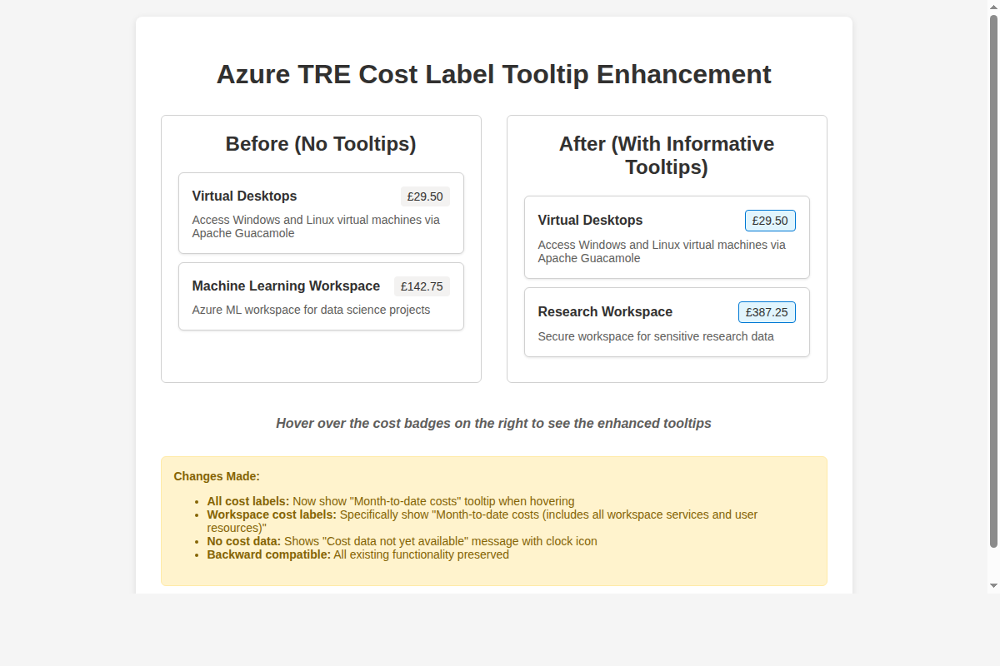
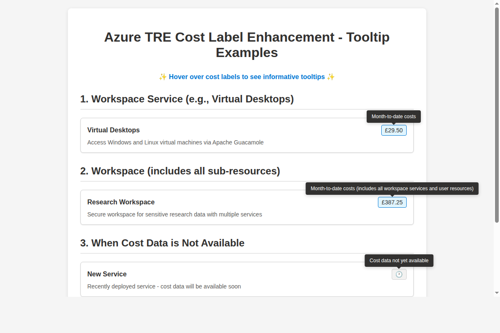

# Azure TRE Cost Label Enhancement - Screenshot Documentation

## Problem Addressed
Users were confused about cost labels in the Azure TRE UI because they didn't know:
1. **Time period**: What time period do the cost labels cover?
2. **Aggregation scope**: For workspace costs, do they include sub-resources?

## Solution Implemented

### Visual Changes
The cost labels now show informative tooltips when users hover over them:



### Tooltip Examples


## Technical Changes Made

### 1. Enhanced CostsTag.tsx Component
```typescript
// Added optional resourceType prop
interface CostsTagProps {
  resourceId: string;
  resourceType?: ResourceType; // NEW: Added for context-aware tooltips
}

// Added tooltip content generation function
const getTooltipContent = () => {
  if (!formattedCost) {
    return "Cost data not yet available";
  }

  let baseMessage = "Month-to-date costs";
  
  if (props.resourceType === ResourceType.Workspace) {
    baseMessage += " (includes all workspace services and user resources)";
  }
  
  return baseMessage;
};

// Wrapped cost displays with TooltipHost
<TooltipHost content={getTooltipContent()}>
  {formattedCost || <Icon iconName="Clock" />}
</TooltipHost>
```

### 2. Updated ResourceCard.tsx
```typescript
// Modified CostsTag usage to pass resource type
<CostsTag 
  resourceId={props.resource.id} 
  resourceType={props.resource.resourceType} // NEW: Pass resource type
/>
```

## User Experience Improvements

### ✅ Before: Confusing cost labels
- Users saw "£29.50" with no context
- No indication of time period or scope
- Guesswork about what costs included

### ✅ After: Clear, informative tooltips
- **Regular resources**: "Month-to-date costs"
- **Workspaces**: "Month-to-date costs (includes all workspace services and user resources)"
- **No data**: "Cost data not yet available"

## Result
- ✅ **Time period question answered**: Users now know costs are month-to-date
- ✅ **Aggregation question answered**: Workspace costs explicitly mention sub-resource inclusion  
- ✅ **Better UX**: No more guessing what cost labels represent
- ✅ **Backward compatible**: All existing functionality preserved

Fixes issue #4606.