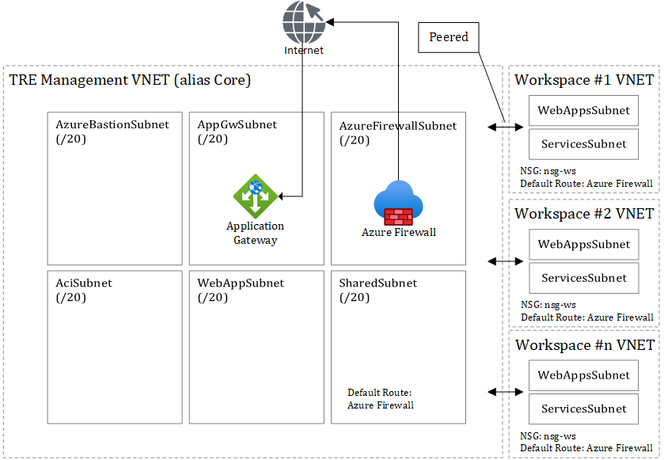

# Overview

The Azure Trusted Research Environment (TRE) consists of multiple components, all encapsulated in networks with restricted ingress- & egress traffic. There is one network for the management components and one network per Workspace. All traffic has to be explicitly allowed by the Application Gateway or the Firewall.


The Azure TRE management plane consists of two groups of components:

- Management API & Composition Service
- Shared Services

> Shared Services is still work in progress. Please see [#23](https://github.com/microsoft/AzureTRE/issues/23), [#22](https://github.com/microsoft/AzureTRE/issues/21), & [#21](https://github.com/microsoft/AzureTRE/issues/21)

Management API is a service that users can interact with to request changes to workspaces e.g., to create, update, delete workspaces and workspace services inside each workspace. The Composition Service is doing the actual work of mutating the state of each Workspace including the Workspace Services.

Ingress/egress components governs all inbound and outbound traffic from the public Internet to and from Azure TRE including the Workspaces. The Firewall Service is managing the egress rules of the Firewall.

Shared Services are services available to all Workspaces. Source Mirror can mirror source repositories such as GitHub, but only allowing read-access, hence data from a Workspace cannot be pushed to a source repository.
Package Mirror is also a read-only front for developer/researcher application package services like NPM, PyPI, and NuGet and operating system application package services like apt-get and Windows Package Manager (winget).

## Composition Service

The Composition Service is responsible for managing and mutating Workspaces and Workspace Service.

A Workspace is an instance of a Workspace Template. A Workspace Template is implemented as a [Porter](https://porter.sh/) bundle - read more about [Authoring workspaces templates](./authoring-workspace-templates.md). A Porter bundle is a full encapsulated versioned bundle with everything needed (binaries, scripts, IoC templates etc.) to provision an instance of Workspace Template.
The [TRE Administrator](./user-roles.md#tre-administrator) can register a Porter bundle to use the Composition Service to provision instances of the Workspace Templates.
To do so requires:

1. The Porter bundle to be pushed to the Azure Container Registry (ACR).
1. Registering the Workspace through Management API.

Details on how to [register a Workspace Template](registering-workspace-templates.md).

### Provision a Workspace


The Composition Service consists of multiple components.

| Component Name | Responsibility / Description |
| --- | --- |
| Management API | An API responsible for performing all operations on Workspaces and managing Workspace Templates. |
| Configuration Store | Keeping the state of Workspaces and Workspace Templates. The store uses [Cosmos DB (SQL)](https://docs.microsoft.com/en-us/azure/cosmos-db/introduction). |
| Service Bus | [Azure Service Bus](https://docs.microsoft.com/en-us/azure/service-bus-messaging/service-bus-messaging-overview) responsible for reliable delivery of messages between components.  |
| Resource Processor | Responsible for starting the process of mutating a Workspace via a Workspace Template. |
| Deployment Client| Responsible for processing the Workspace Template. [Azure CNAB Driver](https://github.com/deislabs/cnab-azure-driver) is used to execute the Porter bundle. |

The flow to provision a Workspace is the following (the flow is the same for all kinds of mutations to a Workspace):

1. A HTTP request to Management API to create a new Workspace. The request contains information like the name of the Workspace, the Workspace Template to use and the parameters required for the Workspace Template (Workspace Templates can via a JSON Schema expose the the parameters).
1. The desired state of the Workspace is updated in the Configuration Store.
1. A command message with the Workspace Template reference and parameters are send to the `workspacequeue`.

    ```JSON
    {
            "action": "install",
            "id": "vanilla",
            "name": "VanillaWorkspaceTemplate",
            "version": "1.0",
            "parameters": {
                "param1": "value1"
            }
        }
    ```

1. The Resource Processor Azure Function is triggered by the arrival of a new message.
1. The Resource Processor processes the command by provisioning an [Azure Container Instance](https://docs.microsoft.com/en-us/azure/container-instances/) (ACI) instance executing the Porter bundle (the implementation of a Workspace Template).

    ```bash
    # simplified for readability
    porter <action> --reference <ACR name>.azurecr.io/bundles/<name>:<version> --params key=value --cred <credentials set name or file>

    # Example
    porter install --reference msfttreacr.azurecr.io/bundles/VanillaWorkspaceTemplate:1.0 --params param1=value1 --cred azure.json
    ```

    Credentials for the Service Principal with Contributor permissions to provision Azure resource is injected into the Porter bundle via [credential set](https://porter.sh/credentials/). The `azure.json` tells Porter where the credential information can be found and for the Resource Processor they are set as environment variables (Vanilla Workspace Template [azure.json](workspaces/vanilla/azure.json)).

    Porter bundle actions are required to be idempotent, so if a deployment fails, the Resource Processor can retry.

    > The Resource Processor is a Docker container running on ACI and a Porter bundle is also a Docker container. Running Docker in Docker is not recommended or supported by ACI. The Resource Processor is using the [Azure CNAB Driver](https://github.com/deislabs/cnab-azure-driver) to execute the Porter bundle. The Azure CNAB Driver instantiates another ACI instance to execute the Porter bundle.

1. The Porter Docker bundle is pulled from the Azure Container Registry (ACR) and executed.
1. The Porter bundle executes against Azure Resource Manager to provision Azure resources. Any kind of infrastructure of code frameworks like ARM, Terraform, or Pulumi can be used or scripted via PowerShell or Azure CLI.
1. State and output management is handled via Azure Storage Containers. State for keeping persistent state between executions of a bundled with the same Workspace. The Porter Out Azure Storage account is used to [parse output from the Porter bundle](https://github.com/deislabs/cnab-azure-driver#dealing-with-bundle-outputs) back to the Composition Service.

    > Currently the bundle keeps state between executions in a Storage Container (TF state) passed in a parameters to the bundle. An enhancement issues [#343](https://github.com/microsoft/AzureTRE/issues/343) exists to generalize state management, so it is not Terraform specific.

1. For the time being, the Porter bundle updates Firewall rules directly setting egress rules. An enhancement to implement a Shared Firewall services is planned ([#23](https://github.com/microsoft/AzureTRE/issues/23)).
1. The Resource Processor sends events to the `deploymentstatus` queue on state changes and informs if the deployment succeeded or failed.
1. The status of a Porter bundle execution is received.
1. The status of a Porter bundle execution is updated in the Configuration Store.

## Network Architecture

The network topology is based on [hub-spoke](https://docs.microsoft.com/en-us/azure/architecture/reference-architectures/hybrid-networking/hub-spoke). The TRE Management VNET ([Azure Virtual Network](https://docs.microsoft.com/en-us/azure/virtual-network/virtual-networks-overview)) is the central hub and each Workspace are spokes.

> Note: TRE Management is referred to as Core in scripts and code.



Azure TRE VNETs are segregated allowing limited traffic between the TRE Management VNET and Workspace VNETs. The rules are managed in the `nsg-ws` Network Security Group (NSG):

- Inbound traffic from TRE Management VNET to Workspace allowed for [Azure Bastion](https://docs.microsoft.com/en-us/azure/bastion/bastion-overview) (22,3389) - All other inbound traffic from Core to Workspace denied.
- Outbound traffic to `SharedSubnet` from Workspace allowed.
- Outbound traffic to Internet allowed on HTTPS port 443 (next hop Azure Firewall).
- All other outbound traffic denied.

> In Azure traffic between subnets are allowed except explicitly denied.

Each of these rules can be managed per Workspace.

Each Workspace has a default route routing all egress traffic through the Azure Firewall, to ensure only explicitly allowed destinations on the Internet to be accessed. It is planned that all other subnet will use the same pattern (Issue [#421](https://github.com/microsoft/AzureTRE/issues/421))

The Azure Firewall rules are:

- No default inbound rules – block all.
- No default outbound rules – block all.

Inbound traffic from the Internet is only allowed through the Application Gateway, which forwards HTTPS (port 443) call to the TRE Management API in the `WebAppSubnet`.

| Subnet | Description |
| -------| ----------- |
| `AzureBastionSubnet` | A dedicated subnet for Azure Bastion hosts. |
| `AppGwSubnet` | Subnet for Azure Application Gateway controlling ingress traffic. |
| `AzureFirewallSubnet` | Subnet for Azure Firewall controlling egress traffic. |
| `AciSubnet` | Subnet for Azure Container Instances (ACI) used by the Composition Service to host Docker containers to execute Porter bundles that deploys Workspaces. |
| `WebAppSubnet` | Subnet for Management API and Resource Processor Function. |
| `SharedSubnet` | Shared Services subnet for all things shared by TRE Management and Workspaces. Future Shared Services are Firewall Shared Service, Source Mirror Shared Service and Package Mirror Shared Service. |
