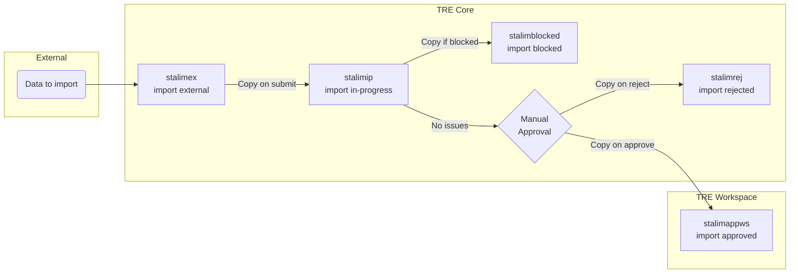
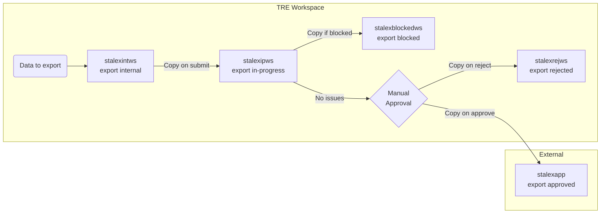
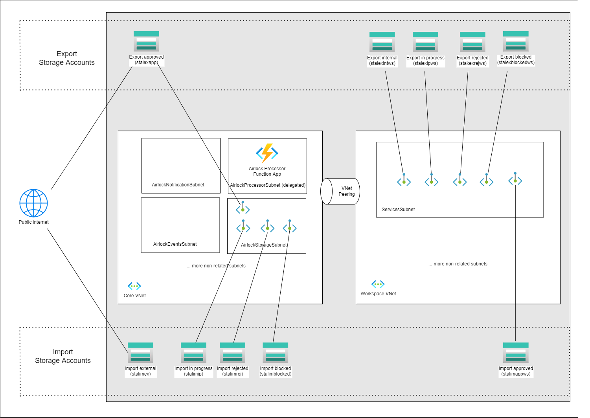
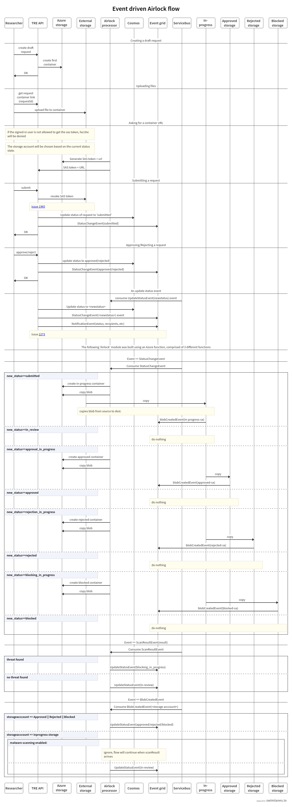

# Legacy Airlock Architecture

!!! warning "Legacy Architecture"
    This page documents the legacy airlock architecture that uses per-stage storage accounts. New deployments should use the current [consolidated architecture](airlock.md). This architecture is maintained for backwards compatibility with existing workspaces.

## Overview

The legacy airlock architecture uses **separate storage accounts for each stage** of the airlock process. Data is physically copied between storage accounts as the request progresses through stages. This results in 5 core storage accounts and 5 per-workspace storage accounts (10+ total).

To use the legacy architecture, set `airlock_version: 1` (the default) in your workspace properties and ensure `enable_legacy_airlock: true` is set in your `config.yaml`.

## Storage Accounts

### Core (TRE-level)

| Storage Account | Name Pattern | Description | Network Access |
|---|---|---|---|
| `stalimex` | `stalimex{tre_id}` | Import external — initial upload location | Public (SAS token) |
| `stalimip` | `stalimip{tre_id}` | Import in-progress — during review | TRE Core VNet |
| `stalimrej` | `stalimrej{tre_id}` | Import rejected | TRE Core VNet |
| `stalimblocked` | `stalimblocked{tre_id}` | Import blocked by scan | TRE Core VNet |
| `stalexapp` | `stalexapp{tre_id}` | Export approved — final export location | Public (SAS token) |

### Workspace-level

| Storage Account | Name Pattern | Description | Network Access |
|---|---|---|---|
| `stalimappws` | `stalimappws{short_ws_id}` | Import approved — final import location | Workspace VNet |
| `stalexintws` | `stalexintws{short_ws_id}` | Export internal — initial export upload | Workspace VNet |
| `stalexipws` | `stalexipws{short_ws_id}` | Export in-progress — during review | Workspace VNet |
| `stalexrejws` | `stalexrejws{short_ws_id}` | Export rejected | Workspace VNet |
| `stalexblockedws` | `stalexblockedws{short_ws_id}` | Export blocked by scan | Workspace VNet |

> Each workspace gets its own set of 5 storage accounts, leading to significant resource proliferation as the number of workspaces grows.

## Data Flow

In the legacy architecture, data is **copied between storage accounts** at each stage transition. A typical import request involves up to 3 copies:

1. External → In-progress (on submit)
2. In-progress → Blocked (if scan fails) OR stay in In-progress (if clean)
3. In-progress → Approved (on approval) OR In-progress → Rejected (on rejection)

> Legacy import data flow — data is copied at each stage transition.

> Legacy export data flow — data is copied at each stage transition.

## Network Architecture

In the legacy architecture, each storage account has its own network configuration:

- **External accounts** (`stalimex`, `stalexapp`): Not bound to any VNet, accessible via SAS token through the internet.
- **Core internal accounts** (`stalimip`, `stalimrej`, `stalimblocked`): Bound to the TRE Core VNet.
- **Workspace accounts** (`stalimappws`, `stalexintws`, `stalexipws`, `stalexrejws`, `stalexblockedws`): Bound to the workspace VNet.

Each storage account has its own private endpoints, EventGrid system topics, and role assignments.

## Airlock Flow

The following diagram shows the legacy airlock flow with data copies between storage accounts:

## Comparison with Current Architecture

| Aspect | Current (Consolidated) | Legacy (Per-Stage) |
|---|---|---|
| **Storage accounts** | 2 total | 10+ (5 core + 5 per workspace) |
| **Stage tracking** | Container metadata | Separate storage accounts |
| **Data copies per request** | 1 (on approval only) | Up to 3 |
| **Workspace isolation** | ABAC + shared PE | Dedicated storage per workspace |
| **Private endpoints** | 2 core + 1 per workspace | 5 core + 5 per workspace |
| **EventGrid topics** | 2 system topics | 10+ system topics |
| **Infrastructure cost** | Lower | Higher (more resources) |
| **Stage transition speed** | Near-instant (metadata) | Minutes (data copy) |
| **Scalability** | All workspaces share storage | Linear growth per workspace |

## Upgrading to Current Architecture

To upgrade a workspace from the legacy architecture:

1. Ensure core is deployed with the current codebase (`enable_legacy_airlock: true` to keep legacy infrastructure alongside the new accounts).
2. Update the workspace `airlock_version` property to `2`.
3. Redeploy the workspace — this switches from the legacy airlock terraform module to the consolidated module.
4. New airlock requests will use the consolidated storage accounts. In-flight requests on the legacy path will continue to completion on the legacy accounts (the version is stamped on each request at creation time).
5. Once all workspaces are migrated and no legacy requests are in-flight, set `enable_legacy_airlock: false` in `config.yaml` and redeploy core to remove the legacy storage accounts.

!!! note
    In-flight airlock requests are safe during upgrade. Each request has `airlock_version` stamped at creation time, so upgrading a workspace does not affect requests that are already in progress.
