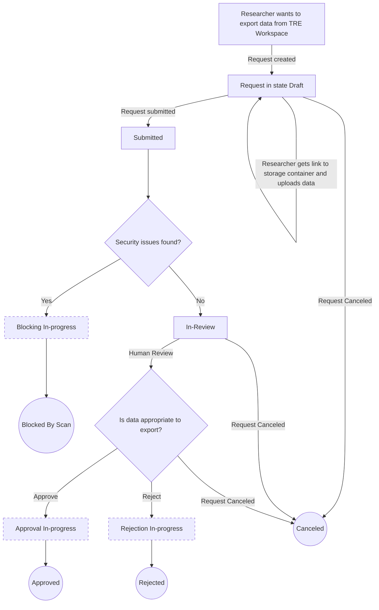
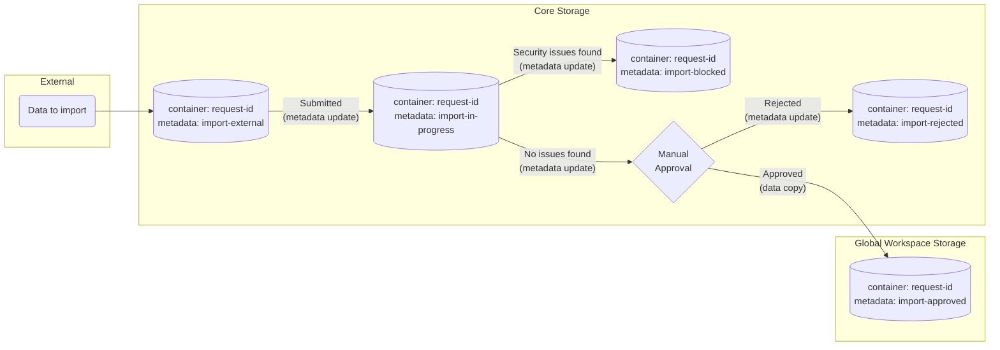
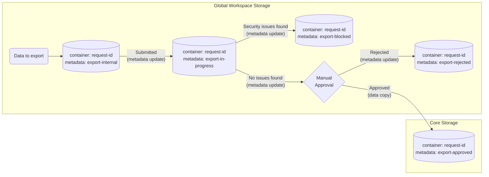
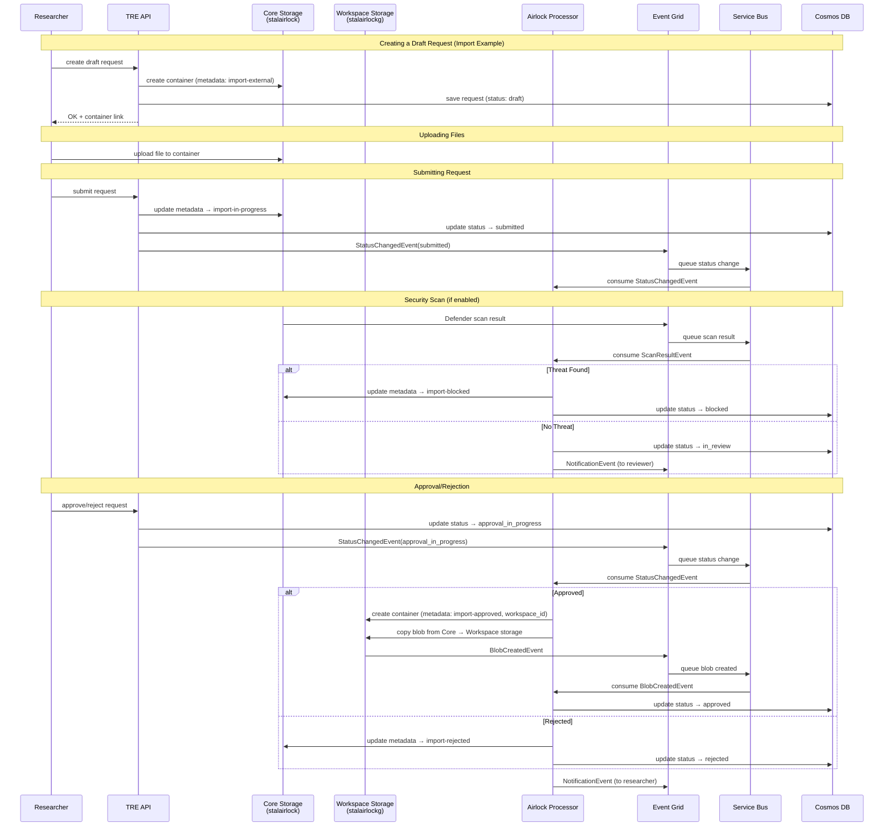

# Airlock

In a Trusted Research Environment (TRE) the workspaces represent a security boundary that enables researchers to access data, execute analysis, apply algorithms and collect reports. The airlock capability is the only mechanism that allows users to `import` or `export` data, tools or other file based artefacts in a secure fashion with a human approval.
This constitutes the mechanism focused on preventing data exfiltration and securing TRE and its workspaces from inappropriate data, while allowing researchers to work on their projects and execute their tasks.
The airlock feature brings several actions: ingress/egress Mechanism; Data movement; Security gates; Approval mechanism and Notifications. As part of TRE's Safe settings all activity must be tracked for auditing purposes.

The Airlock feature aims to address these goals:

* Prevent unauthorised data import or export.

* Provide a process to allow approved data to be imported through the security boundary of a TRE Workspace.

* TRE provides functionality to track requests and decisions, supporting cycles of revision, approval or rejection.

* Data being imported with an airlock import process can be automatically scanned for security issues.

* Data being exported or imported must be manually reviewed by the Airlock Manager.

* Notify the requesting researcher of the process progress and/or required actions.

* All steps within the airlock process are audited.

Typically in a TRE, the Airlock feature would be used to allow a researcher to export the outputs of a research project such as summary results. With the airlock, data to be exported must go through a human review, typically undertaken by a data governance team.

The Airlock feature will create events on every meaningful step of the process. This will enable increased flexibility by allowing an organization to extend the notification mechanism.

## Storage Architecture

The airlock uses a consolidated storage architecture with **2 storage accounts** and metadata-based stage management:

1. **Core Storage** (`stalairlock{tre_id}`): Handles all core stages
   - Import: external, in-progress, rejected, blocked
   - Export: approved
   - Accessed via private endpoint (processor) and SAS tokens (public stages)

2. **Global Workspace Storage** (`stalairlockg{tre_id}`): Handles all workspace stages for all workspaces
   - Import: approved
   - Export: internal, in-progress, rejected, blocked
   - Each workspace has its own private endpoint for network isolation
   - ABAC (Attribute-Based Access Control) filters access by workspace_id + stage

## Ingress/Egress Mechanism

The Airlock allows a TRE user to start the `import` or `export` process to a given workspace. A number of milestones must be reached in order to complete a successful import or export. These milestones are defined using the following states:

1. **Draft**: An Airlock request has been created but has not yet started. The TRE User/Researcher has now access to a storage location and they must identify the data to be processed. At this point the airlock import/export processes allow a single file to be processed. However a compressed file may be used (zip).
2. **Submitted**: The request was submitted by the researcher (not yet processed).
3. **In-Review**: The request is ready to be reviewed. This state can be reached directly from Submitted state or after going through a successful security scan (found clean).
4. **Approval In-progress**: The Airlock request has been approved, however data movement is still ongoing.
5. **Approved**: The Airlock request has been approved. At this state, data has been securely verified and manually reviewed. The data is now in its final location. For an import process the data is now available in the TRE workspace, it can be accessed by the requestor from within the workspace.
6. **Rejection In-progress**: The Airlock request has been rejected, however data movement is still ongoing.
7. **Rejected**: The Airlock request has been rejected. The data in the process was rejected manually by the Airlock Manager.
8. **Cancelled**: The Airlock request was manually cancelled by the requestor TRE user, a Workspace owner or a TRE administrator. The cancelation is only allowed when the request is not actively changing (i.e. **Draft** or **In-Review** state).
9. **Blocking In-progress**: The Airlock request has been blocked, however data movement is still ongoing.
10. **Blocked By Scan**: The Airlock request has been blocked. The security analysis found issues in the submitted data and consequently quarantined the data.

> Airlock state flow diagram for an Airlock export request

When an airlock process is created the initial state is **Draft** and the required infrastructure will get created providing a single container to isolate the data in the request. Once completed, the user will be able to get a link for this container inside the storage account (URL + SAS token) that they can use to upload the desired data to be processed (import or export).

This storage location is in the core storage account (`stalairlock`) for import external or the global workspace storage (`stalairlockg`) for export internal, accessible only to the requestor (ex: a TRE user/researcher) via SAS token.
The user will be able to upload a file to the provided storage location, using any tool of their preference: [Azure Storage Explorer](https://azure.microsoft.com/en-us/features/storage-explorer/) or [AzCopy](https://docs.microsoft.com/en-us/azure/storage/common/storage-use-azcopy-v10) which is a command line tool.

The user Submits the request (TRE API call) updating the container metadata to the next stage. For import, the container remains in core storage. For export, the container remains in workspace storage. The airlock request is now in state **Submitted**.
If enabled, the Malware Scanning is started. The scan is done using Microsoft Defender for Storage, which is described in detail in the [Microsoft Defender for Storage documentation](https://learn.microsoft.com/en-us/azure/defender-for-cloud/defender-for-storage-introduction).
In the case that security flaws are found, the container metadata is updated to blocked status. In this case, the request is finalized with the state **Blocked By Scan**.
If the Security Scanning does not identify any security flaws, the container metadata is updated to in-review status, and the request state becomes **In-Review**. Simultaneously, a notification is sent to the Airlock Manager user. The user needs to ask for the container URL using the TRE API (SAS token + URL with READ permission).

> The Security Scanning can be disabled, changing the request state from **Submitted** straight to **In-Review**.

The Airlock Manager will manually review the data using the tools of their choice available in the TRE workspace. Once review is completed, the Airlock Manager will have to *Approve* or *Reject* the airlock process, through a TRE API call.
At this point, the request will change state to either **Approval In-progress** or **Rejection In-progress**. For approval, data is copied to the final destination (core storage to workspace storage for import, workspace storage to core storage for export). For rejection, only metadata is updated. The request then moves to **Approved** or **Rejected** accordingly.

## Data movement

For any airlock process, there is data movement either **into** a TRE workspace (in import process) or **from** a TRE workspace (in export process). Being a TRE Workspace boundary, there are networking configurations designed to achieve this goal. The data movement will guarantee that the data is automatically verified for security flaws and manually reviewed, before placing data inside the TRE Workspace.
Also, the process guarantees that data is not tampered with throughout the process.

**Metadata-Based Stage Management:**
Most stage transitions update container metadata only, providing near-instant transitions. Data is copied only when moving between storage accounts:
- **Import approved**: Core storage → Global workspace storage  (1 copy per import)
- **Export approved**: Global workspace storage → Core storage (1 copy per export)

All other transitions (draft→submitted, submitted→in-review, in-review→rejected/blocked) update metadata only.

In an import process, data will transition from more public locations (yet confined to the requestor) to TRE workspace storage, after guaranteeing security automatically and by manual review.

In an export process, data will transition from internal locations (available to the requestor) to public locations in the TRE, after going through a manual review.

The data movement mechanism is data-driven, allowing an organization to extend how request data transitions between states.

## Security Scan

The identified data in an airlock process, will be submitted to a security scan. If the security scan
identifies issues the data is quarantined by updating the container metadata to blocked status and a report
is added to the process metadata. Both the requestor and Workspace Owner are notified. For a successful
security scan, the container metadata remains at in-progress status, and accessible to the Workspace Owner.

> * The Security scan is optional, behind a feature flag enabled by a script
> * The outcome of the security scan will be either the in-progress metadata status or blocked metadata status
> * An airlock process will guarantee that the content being imported/exported is secure. It is envisioned that a set of **security gates** are identified to be executed successfully for a process to be approved.

## Approval mechanism

The approval mechanism, is bundled with any airlock process, providing a specific way to `approve` or `reject` the data. This mechanism will allow the Airlock Managers to explicitly approve/reject the process, after having access to the data. The Airlock Manager users will be able to execute a manual review on the data using the tools available to them in a review TRE Workspace.
Once this manual review is executed, Airlock Managers can proactively approve or reject the airlock request.

The only goal of the Approval mechanism is to provide a cycle of revision, approval or rejection while tracking the decision.

This mechanism will provide access to the data in the airlock process, and will be able to use a VM in TRE workspace. The data review will be the Airlock Manager responsibility

> * It is envisioned that this mechanism to be more flexible and extensible.
> * The `Airlock Manager` is a role defined at the workspace instance level and assigned to identities. Initially, the `Owner` role will be used.

## Notifications

Throughout the airlock process, the notification mechanism will notify the relevant people of the process. Both the requestor (TRE User/Researcher) and the Workspace Owner will be notified by email of the relevant process events.

Whenever the airlock process changes to a state of **Draft**, **Submitted**, **Approved**, **Rejected**, **Approval In-progress**, **Rejection In-progress**, **Blocked By Scan** or **Cancelled**, the process requestor gets notified.
When the state changes to `In-progress` the Workspace Owner (Airlock Manager) gets notified.

> * The Notification mechanism is also data-driven, allowing an organization to extend the notifications behavior. The mechanism is exemplified with a Logic App determining the notifications logic.
> * Notifications will work with All TRE users being Microsoft Entra ID users (guests or not), with email defined – if not, notifications will not be sent.

## Architecture

The Airlock feature is supported by a consolidated storage architecture with **2 storage accounts** and metadata-based stage management. Each Airlock request uses a unique storage container named with the request ID, and the stage is tracked via container metadata.

**Storage Accounts:**

1. **Core Storage** (`stalairlock{tre_id}`): Handles all core stages
   - Import: external, in-progress, rejected, blocked
   - Export: approved
   - Private endpoint from airlock processor subnet
   - Public access for external/approved stages via SAS tokens

2. **Global Workspace Storage** (`stalairlockg{tre_id}`): Handles all workspace stages for all workspaces
   - Import: approved
   - Export: internal, in-progress, rejected, blocked
   - Each workspace has its own private endpoint for network isolation
   - ABAC (Attribute-Based Access Control) filters access by workspace_id + stage

> Data movement in an Airlock import request. Most transitions update metadata only; data is copied only on approval.

> Data movement in an Airlock export request. Most transitions update metadata only; data is copied only on approval.

**Container Metadata Stages:**

Core Storage (`stalairlock`):
* `import-external` - Initial upload location for imports (public via SAS)
* `import-in-progress` - After submission, during review
* `import-rejected` - Import rejected by reviewer
* `import-blocked` - Import blocked by security scan
* `export-approved` - Final location for approved exports (public via SAS)

Global Workspace Storage (`stalairlockg`):
* `import-approved` - Final location for approved imports (workspace access)
* `export-internal` - Initial upload location for exports (workspace access)
* `export-in-progress` - After submission, during review
* `export-rejected` - Export rejected by reviewer
* `export-blocked` - Export blocked by security scan

**Network Access:**
> * Core storage has a private endpoint from the airlock processor subnet for internal processing
> * Core storage allows public access via SAS tokens for import-external and export-approved stages
> * Global workspace storage has a private endpoint per workspace for network isolation
> * ABAC conditions restrict each workspace's access to containers matching their workspace_id
> * The airlock processor has unrestricted access to both storage accounts for data operations

In the TRE Core, the TRE API will provide the airlock API endpoints allowing to advance the process. The TRE API will expose the following methods:

| Method | Endpoint | Description |
| --- | --- | --- |
| `POST` | `/api/workspaces/{workspace_id}/requests` | Create an Airlock request (in **Draft**) |
| `POST` | `/api/workspaces/{workspace_id}/requests/{airlock_request_id}/link` | Get the url and token to access an Airlock Request |
| `POST` | `/api/workspaces/{workspace_id}/requests/{airlock_request_id}/submit` | Submits an Airlock request |
| `POST` | `/api/workspaces/{workspace_id}/requests/{airlock_request_id}/review` | Reviews an Airlock request |
| `POST` | `/api/workspaces/{workspace_id}/requests/{airlock_request_id}/cancel` | Cancels an Airlock request |

Also in the airlock feature there is the **Airlock Processor** which handles the events that are created throughout the process, signalling state changes from blobs created, status changed or security scans finalized.

## Airlock flow

The following sequence diagram details the Airlock feature and its event-driven behaviour with consolidated storage:

