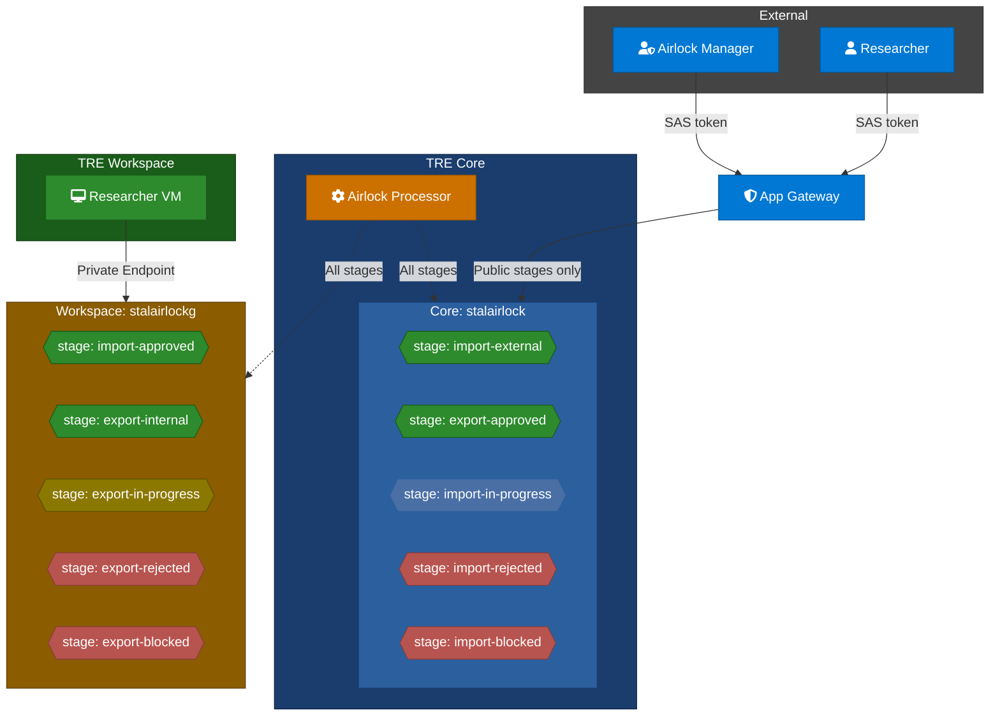
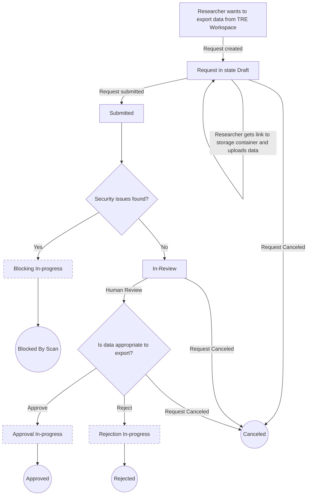
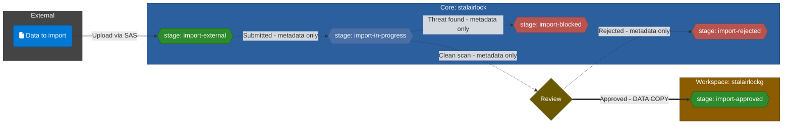
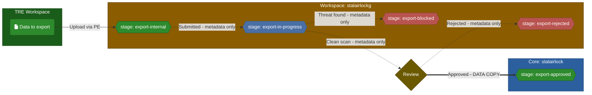
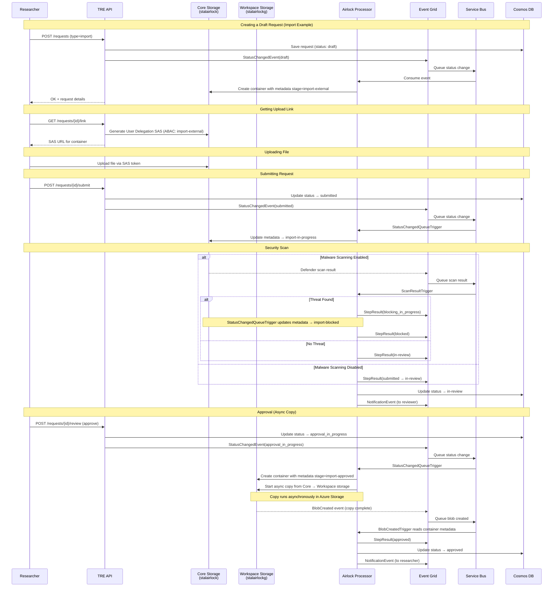
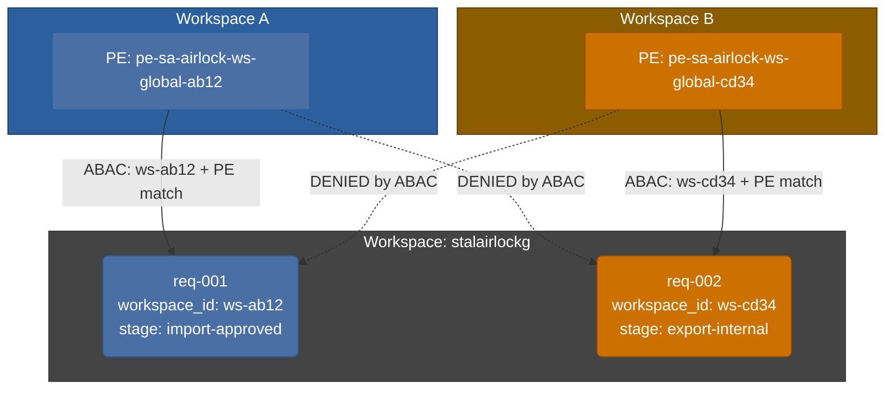

# Airlock

In a Trusted Research Environment (TRE) the workspaces represent a security boundary that enables researchers to access data, execute analysis, apply algorithms and collect reports. The airlock capability is the only mechanism that allows users to `import` or `export` data, tools or other file based artefacts in a secure fashion with a human approval.
This constitutes the mechanism focused on preventing data exfiltration and securing TRE and its workspaces from inappropriate data, while allowing researchers to work on their projects and execute their tasks.
The airlock feature brings several actions: ingress/egress mechanism, data movement, security gates, approval mechanism and notifications. As part of TRE's Safe Settings all activity must be tracked for auditing purposes.

The Airlock feature aims to address these goals:

* Prevent unauthorised data import or export.
* Provide a process to allow approved data to be imported through the security boundary of a TRE Workspace.
* Track requests and decisions, supporting cycles of revision, approval or rejection.
* Automatically scan data being imported for security issues.
* Require manual review by the Airlock Manager for data being exported or imported.
* Notify the requesting researcher of progress and required actions.
* Audit all steps within the airlock process.

Typically in a TRE, the Airlock feature would be used to allow a researcher to export the outputs of a research project such as summary results. With the airlock, data to be exported must go through a human review, typically undertaken by a data governance team.

The Airlock feature creates events on every meaningful step of the process, enabling organisations to extend the notification mechanism.

## Storage Architecture

The airlock uses a consolidated storage architecture with **2 storage accounts** and metadata-based stage management. Each airlock request gets a dedicated container (named with the request ID), and the request's stage is tracked via container metadata rather than by copying data between storage accounts.


```mermaid
graph TB
    subgraph External["External"]
        researcher["fa:fa-user Researcher"]
        reviewer["fa:fa-user-shield Airlock Manager"]
    end

    appgw["fa:fa-shield-alt App Gateway"]

    subgraph Core["TRE Core"]
        direction TB
        subgraph CoreStorage["Core: stalairlock"]
            ie{{"stage: import-external"}}
            eapp{{"stage: export-approved"}}
            iip{{"stage: import-in-progress"}}
            irej{{"stage: import-rejected"}}
            iblk{{"stage: import-blocked"}}
        end
        processor["fa:fa-cog Airlock Processor"]
    end

    subgraph WSStorage["Workspace: stalairlockg"]
        iappr{{"stage: import-approved"}}
        eint{{"stage: export-internal"}}
        eip{{"stage: export-in-progress"}}
        erej{{"stage: export-rejected"}}
        eblk{{"stage: export-blocked"}}
    end

    subgraph Workspace["TRE Workspace"]
        vm["fa:fa-desktop Researcher VM"]
    end

    researcher -- "SAS token" --> appgw
    reviewer -- "SAS token" --> appgw
    appgw -- "Public stages only" --> CoreStorage
    processor -. "All stages" .-> CoreStorage
    processor -. "All stages" .-> WSStorage
    vm -- "Private Endpoint" --> WSStorage

    style Core fill:#1a3d6d,stroke:#0d2240,color:#fff
    style CoreStorage fill:#2c5f9e,stroke:#1a3d6d,color:#fff
    style WSStorage fill:#8b5c00,stroke:#5c3d00,color:#fff
    style External fill:#444,stroke:#333,color:#fff
    style Workspace fill:#1a5c1a,stroke:#0d330d,color:#fff
    style appgw fill:#0078d4,stroke:#005a9e,color:#fff
    style processor fill:#cc7000,stroke:#995300,color:#fff
    style vm fill:#2d8a2d,stroke:#1a5c1a,color:#fff
    style ie fill:#2d8a2d,stroke:#1a5c1a,color:#fff
    style eapp fill:#2d8a2d,stroke:#1a5c1a,color:#fff
    style iip fill:#4a6fa5,stroke:#2c5f9e,color:#fff
    style irej fill:#b85450,stroke:#8b3e3b,color:#fff
    style iblk fill:#b85450,stroke:#8b3e3b,color:#fff
    style iappr fill:#2d8a2d,stroke:#1a5c1a,color:#fff
    style eint fill:#2d8a2d,stroke:#1a5c1a,color:#fff
    style eip fill:#8b7800,stroke:#5c5000,color:#fff
    style erej fill:#b85450,stroke:#8b3e3b,color:#fff
    style eblk fill:#b85450,stroke:#8b3e3b,color:#fff
    style researcher fill:#0078d4,stroke:#005a9e,color:#fff
    style reviewer fill:#0078d4,stroke:#005a9e,color:#fff
```
> Airlock architecture overview. Hexagon shapes represent container metadata stages. Green = user-accessible, yellow = processing, red = terminal.

**Storage Accounts:**

| Storage Account | Name Pattern | Purpose |
| --- | --- | --- |
| **Core Storage** | `stalairlock{tre_id}` | All core-managed stages: import external, in-progress, rejected, blocked; export approved |
| **Global Workspace Storage** | `stalairlockg{tre_id}` | All workspace-managed stages: import approved; export internal, in-progress, rejected, blocked |

**Key design principles:**

- **Metadata over movement** — Most stage transitions simply update container metadata, providing near-instant transitions. Data is only physically copied when crossing the core/workspace boundary (once per request).
- **ABAC security** — Azure Attribute-Based Access Control conditions restrict which stages each identity can access on the storage account, enforced at the Azure RBAC layer.
- **Shared infrastructure** — All workspaces share the same workspace storage account, with network isolation via per-workspace private endpoints and ABAC conditions filtering by `workspace_id`.

## Ingress/Egress Mechanism

The Airlock allows a TRE user to start the `import` or `export` process to a given workspace. A number of milestones must be reached in order to complete a successful import or export. These milestones are defined using the following states:

1. **Draft**: An Airlock request has been created but has not yet started. The TRE User/Researcher has access to a storage container and must upload the data to be processed. At this point the airlock import/export processes allow a single file to be processed. However a compressed file may be used (zip).
2. **Submitted**: The request was submitted by the researcher (not yet processed).
3. **In-Review**: The request is ready to be reviewed. This state can be reached directly from Submitted state or after going through a successful security scan (found clean).
4. **Approval In-progress**: The Airlock request has been approved, however data movement is still ongoing.
5. **Approved**: The Airlock request has been approved. Data has been securely verified and manually reviewed. The data is now in its final location. For an import process the data is available in the TRE workspace and can be accessed by the requestor from within the workspace.
6. **Rejection In-progress**: The Airlock request has been rejected, however data movement is still ongoing.
7. **Rejected**: The Airlock request has been rejected. The data was rejected manually by the Airlock Manager.
8. **Cancelled**: The Airlock request was manually cancelled by the requestor, a Workspace Owner, or a TRE administrator. Cancellation is only allowed when the request is not actively changing (i.e. **Draft** or **In-Review** state).
9. **Blocking In-progress**: The Airlock request has been blocked, however data movement is still ongoing.
10. **Blocked By Scan**: The Airlock request has been blocked. The security analysis found issues in the submitted data and consequently quarantined the data.


```mermaid
graph TD
  A[Researcher wants to export data from TRE Workspace] -->|Request created| B[Request in state Draft]
  B-->|Researcher gets link to storage container and uploads data| B
  B-->|Request submitted| C[Submitted]
  C--> D{Security issues found?}
  D-->|Yes| E[Blocking In-progress]
  D-->|No| G[In-Review]
  E:::temporary--> F((Blocked By Scan))
  G-->|Human Review| H{Is data appropriate to export?}
  H-->|Approve| I[Approval In-progress]
  H-->|Reject| J[Rejection In-progress]
  I:::temporary-->K((Approved))
  J:::temporary-->L((Rejected))
  B-->|Request Canceled| X((Canceled))
  G-->|Request Canceled| X
  H-->|Request Canceled| X
  classDef temporary stroke-dasharray: 5 5
```
> Airlock state flow diagram for an export request. Import follows the same flow.

When an airlock process is created the initial state is **Draft** and the airlock processor creates a storage container with the appropriate stage metadata. The user receives a link to this container (URL + SAS token) that they can use to upload data.

For import, the container is created in core storage (`stalairlock`) with metadata `stage=import-external`. For export, the container is created in global workspace storage (`stalairlockg`) with metadata `stage=export-internal`, accessible only from within the workspace via private endpoint.

The user uploads a file using any tool of their preference: [Azure Storage Explorer](https://azure.microsoft.com/en-us/features/storage-explorer/) or [AzCopy](https://docs.microsoft.com/en-us/azure/storage/common/storage-use-azcopy-v10).

The user submits the request (TRE API call), which updates the container metadata to the next stage. The airlock request is now in state **Submitted**.

If enabled, malware scanning is started using Microsoft Defender for Storage
(see [Microsoft Defender for Storage documentation](https://learn.microsoft.com/en-us/azure/defender-for-cloud/defender-for-storage-introduction)).
If security flaws are found, the container metadata is updated to blocked status and the request is finalised with state **Blocked By Scan**.
If no issues are found, the metadata is updated to in-review status and the request state becomes **In-Review**.
A notification is sent to the Airlock Manager.

> The Security Scanning can be disabled, changing the request state from **Submitted** straight to **In-Review**.

The Airlock Manager manually reviews the data using tools available in the TRE workspace. Once review is completed, the Airlock Manager approves or rejects the request through a TRE API call. For approval, data is copied to the final destination. For rejection, only metadata is updated.

## Data Movement

For any airlock process, there is data movement either **into** a TRE workspace (import) or **from** a TRE workspace (export). The data movement guarantees that data is automatically verified for security flaws and manually reviewed before being placed inside or taken outside the TRE Workspace.

**Metadata-based stage management** means most transitions are near-instantaneous metadata updates. Data is only physically copied when it crosses the core/workspace boundary:

- **Import approved**: Core storage → Workspace storage (1 async copy per import)
- **Export approved**: Workspace storage → Core storage (1 async copy per export)

All other transitions — draft→submitted, submitted→in-review, in-review→rejected/blocked — update metadata only with no data movement.

Cross-account copies are **asynchronous**: the processor initiates the copy and returns. When the blob appears at the destination, a BlobCreated event fires and the BlobCreatedTrigger reads container metadata to emit the appropriate StepResult. This matches the original airlock design where "in-progress" states represent ongoing data movement operations, supporting large data transfers gracefully.

### Import Data Flow


```mermaid
graph LR
    subgraph External["External"]
        data("fa:fa-file Data to import")
    end

    subgraph CoreStorage["Core: stalairlock"]
        A{{"stage: import-external"}}
        B{{"stage: import-in-progress"}}
        D{{"stage: import-blocked"}}
        C{{"stage: import-rejected"}}
    end

    subgraph WorkspaceStorage["Workspace: stalairlockg"]
        E{{"stage: import-approved"}}
    end

    data -- "Upload via SAS" --> A
    A -. "Submitted - metadata only" .-> B
    B -. "Threat found - metadata only" .-> D
    B -. "Clean scan - metadata only" .-> review{"Review"}
    review -. "Rejected - metadata only" .-> C
    review == "Approved - DATA COPY" ==> E

    style External fill:#444,stroke:#333,color:#fff
    style CoreStorage fill:#2c5f9e,stroke:#1a3d6d,color:#fff
    style WorkspaceStorage fill:#8b5c00,stroke:#5c3d00,color:#fff
    style data fill:#0078d4,stroke:#005a9e,color:#fff
    style A fill:#2d8a2d,stroke:#1a5c1a,color:#fff
    style B fill:#4a6fa5,stroke:#2c5f9e,color:#fff
    style C fill:#b85450,stroke:#8b3e3b,color:#fff
    style D fill:#b85450,stroke:#8b3e3b,color:#fff
    style E fill:#2d8a2d,stroke:#1a5c1a,color:#fff
    style review fill:#6b5900,stroke:#4a3d00,color:#fff
```
> Import data flow. Dashed lines = metadata-only transitions. Thick line = the only data copy (on approval). Hexagons = container metadata stages.

### Export Data Flow


```mermaid
graph LR
    subgraph Workspace["TRE Workspace"]
        data("fa:fa-file Data to export")
    end

    subgraph WorkspaceStorage["Workspace: stalairlockg"]
        A{{"stage: export-internal"}}
        B{{"stage: export-in-progress"}}
        D{{"stage: export-blocked"}}
        C{{"stage: export-rejected"}}
    end

    subgraph CoreStorage["Core: stalairlock"]
        E{{"stage: export-approved"}}
    end

    data -- "Upload via PE" --> A
    A -. "Submitted - metadata only" .-> B
    B -. "Threat found - metadata only" .-> D
    B -. "Clean scan - metadata only" .-> review{"Review"}
    review -. "Rejected - metadata only" .-> C
    review == "Approved - DATA COPY" ==> E

    style Workspace fill:#1a5c1a,stroke:#0d330d,color:#fff
    style WorkspaceStorage fill:#8b5c00,stroke:#5c3d00,color:#fff
    style CoreStorage fill:#2c5f9e,stroke:#1a3d6d,color:#fff
    style data fill:#2d8a2d,stroke:#1a5c1a,color:#fff
    style A fill:#2d8a2d,stroke:#1a5c1a,color:#fff
    style B fill:#4a6fa5,stroke:#2c5f9e,color:#fff
    style C fill:#b85450,stroke:#8b3e3b,color:#fff
    style D fill:#b85450,stroke:#8b3e3b,color:#fff
    style E fill:#2d8a2d,stroke:#1a5c1a,color:#fff
    style review fill:#6b5900,stroke:#4a3d00,color:#fff
```
> Export data flow. Dashed lines = metadata-only transitions. Thick line = the only data copy (on approval). Hexagons = container metadata stages.

## Security Scan

Data in an airlock process is submitted to a security scan. If the scan identifies issues, the container metadata is updated to blocked status and a report is added to the process metadata. Both the requestor and Workspace Owner are notified. For a successful security scan, data remains accessible to the Workspace Owner for review.

> * The security scan is optional, behind a feature flag enabled by a script.
> * The outcome of the security scan will be either the in-progress metadata status or blocked metadata status.
> * An airlock process guarantees that the content being imported/exported is secure.

## Access Control

The airlock uses Azure Attribute-Based Access Control (ABAC) to restrict access at the storage account level. This ensures that identities can only access containers matching specific stage metadata values.


```mermaid
graph LR
    api["fa:fa-key TRE API"]
    proc["fa:fa-cog Airlock Processor"]
    wspe["fa:fa-lock Workspace PE"]

    subgraph CoreStorage["Core: stalairlock"]
        cs_ie{{"stage: import-external"}}
        cs_eapp{{"stage: export-approved"}}
        cs_iip{{"stage: import-in-progress"}}
        cs_irej{{"stage: import-rejected"}}
        cs_iblk{{"stage: import-blocked"}}
    end

    subgraph WorkspaceStorage["Workspace: stalairlockg"]
        ws_iapp{{"stage: import-approved"}}
        ws_eint{{"stage: export-internal"}}
        ws_eip{{"stage: export-in-progress"}}
        ws_erej{{"stage: export-rejected"}}
        ws_eblk{{"stage: export-blocked"}}
    end

    api -- "ABAC: import-external OR export-approved" --> CoreStorage
    proc == "Unrestricted access" ==> CoreStorage
    proc == "Unrestricted access" ==> WorkspaceStorage
    wspe -- "ABAC: workspace_id + stage" --> WorkspaceStorage

    style api fill:#b85450,stroke:#8b3e3b,color:#fff
    style proc fill:#cc7000,stroke:#995300,color:#fff
    style wspe fill:#6a3d9a,stroke:#4a2b6d,color:#fff
    style CoreStorage fill:#2c5f9e,stroke:#1a3d6d,color:#fff
    style WorkspaceStorage fill:#8b5c00,stroke:#5c3d00,color:#fff
    style cs_ie fill:#2d8a2d,stroke:#1a5c1a,color:#fff
    style cs_eapp fill:#2d8a2d,stroke:#1a5c1a,color:#fff
    style cs_iip fill:#4a6fa5,stroke:#2c5f9e,color:#fff
    style cs_irej fill:#8b3e3b,stroke:#6b2e2b,color:#fff
    style cs_iblk fill:#8b3e3b,stroke:#6b2e2b,color:#fff
    style ws_iapp fill:#2d8a2d,stroke:#1a5c1a,color:#fff
    style ws_eint fill:#2d8a2d,stroke:#1a5c1a,color:#fff
    style ws_eip fill:#4a6fa5,stroke:#2c5f9e,color:#fff
    style ws_erej fill:#8b3e3b,stroke:#6b2e2b,color:#fff
    style ws_eblk fill:#8b3e3b,stroke:#6b2e2b,color:#fff
```
> ABAC access control. The API can only access public stages (green). The Processor has full access. Workspace PEs are scoped by workspace_id.

**Identity access summary:**

| Identity | Core Storage | Workspace Storage | ABAC Condition |
| --- | --- | --- | --- |
| TRE API | `Storage Blob Data Contributor` | — | Only `import-external` and `export-approved` stages |
| Airlock Processor | `Storage Blob Data Contributor` | `Storage Blob Data Contributor` | None (unrestricted) |
| Workspace PE | — | `Storage Blob Data Contributor` | `workspace_id` must match + stage restrictions |

**Network access:**

- Core storage allows public access for import-external and export-approved stages via SAS tokens (through the App Gateway).
- Global workspace storage uses `Deny` as the default network action. Access is only possible via per-workspace private endpoints from within the workspace VNet.
- The airlock processor has a private endpoint on the airlock storage subnet for internal processing on both accounts.
- User Delegation SAS tokens inherit the ABAC restrictions of the signing identity, so even a valid SAS token cannot access stages outside the identity's ABAC scope.

### Container Metadata Stages

Each container has a `stage` metadata key that tracks the current stage of the airlock request:

**Core Storage (`stalairlock`):**

| Stage | Description | Access |
| --- | --- | --- |
| `import-external` | Initial upload location for imports | Public via SAS |
| `import-in-progress` | After submission, during review | Processor only |
| `import-rejected` | Import rejected by reviewer | Processor only |
| `import-blocked` | Import blocked by security scan | Processor only |
| `export-approved` | Final location for approved exports | Public via SAS |

**Global Workspace Storage (`stalairlockg`):**

| Stage | Description | Access |
| --- | --- | --- |
| `import-approved` | Final location for approved imports | Workspace PE |
| `export-internal` | Initial upload location for exports | Workspace PE |
| `export-in-progress` | After submission, during review | Processor only |
| `export-rejected` | Export rejected by reviewer | Processor only |
| `export-blocked` | Export blocked by security scan | Processor only |

## Approval Mechanism

The approval mechanism is bundled with any airlock process, providing a specific way to `approve` or `reject` the data. Airlock Managers can explicitly approve/reject the process after reviewing the data using tools available in a review TRE Workspace.

The only goal of the approval mechanism is to provide a cycle of revision, approval or rejection while tracking the decision.

> * It is envisioned that this mechanism will be more flexible and extensible.
> * The `Airlock Manager` is a role defined at the workspace instance level and assigned to identities.

## Notifications

Throughout the airlock process, the notification mechanism notifies the relevant people. Both the requestor (TRE User/Researcher) and the Workspace Owner are notified by email of relevant process events.

Whenever the airlock process changes to a state of **Draft**, **Submitted**, **Approved**, **Rejected**, **Approval In-progress**, **Rejection In-progress**, **Blocked By Scan** or **Cancelled**, the process requestor gets notified.
When the state changes to **In-Review**, the Workspace Owner (Airlock Manager) gets notified.

> * The notification mechanism is data-driven, allowing an organisation to extend the notifications behaviour. The mechanism is exemplified with a Logic App determining the notifications logic.
> * Notifications work with all TRE users being Microsoft Entra ID users (guests or not), with email defined — if not, notifications will not be sent.

## API Endpoints

The TRE API exposes the following airlock endpoints:

| Method | Endpoint | Description |
| --- | --- | --- |
| `POST` | `/api/workspaces/{workspace_id}/requests` | Create an Airlock request (in **Draft**) |
| `GET` | `/api/workspaces/{workspace_id}/requests/{airlock_request_id}/link` | Get the url and token to access an Airlock Request |
| `POST` | `/api/workspaces/{workspace_id}/requests/{airlock_request_id}/submit` | Submit an Airlock request |
| `POST` | `/api/workspaces/{workspace_id}/requests/{airlock_request_id}/review` | Review an Airlock request |
| `POST` | `/api/workspaces/{workspace_id}/requests/{airlock_request_id}/cancel` | Cancel an Airlock request |

## Airlock Processor

The **Airlock Processor** is a set of Azure Functions that handle the events created throughout the airlock process:

- **StatusChangedQueueTrigger** — Consumes status change events from the Service Bus queue and orchestrates container creation, metadata updates, and cross-account data copies. For same-account transitions (most stages), it updates container metadata directly. For cross-account transitions (approval), it initiates an async server-side copy and returns — the copy completion is handled by the BlobCreatedTrigger.
- **BlobCreatedTrigger** — Fires when a blob appears in a storage account (via EventGrid → Service Bus). For cross-account copies, this signals that the copy has completed and emits a StepResult event to advance the request to its final state (e.g., approved, rejected, blocked).
- **ScanResultTrigger** — Consumes malware scan results from Microsoft Defender for Storage. If threats are found, emits a StepResult to block the request. If clean, emits a StepResult to advance to in-review.
- **DataDeletionTrigger** — Cleans up source containers after data has been copied to the destination.

This event-driven design ensures that long-running data copies (which may take minutes for large files) are handled asynchronously, matching the original airlock architecture's use of "in-progress" states to represent ongoing operations.

## Airlock Flow

The following sequence diagram details the airlock feature and its event-driven behaviour:


```mermaid
sequenceDiagram
    participant R as Researcher
    participant API as TRE API
    participant CS as Core Storage<br/>(stalairlock)
    participant WS as Workspace Storage<br/>(stalairlockg)
    participant AP as Airlock Processor
    participant EG as Event Grid
    participant SB as Service Bus
    participant DB as Cosmos DB

    Note over R,DB: Creating a Draft Request (Import Example)
    R->>API: POST /requests (type=import)
    API->>DB: Save request (status: draft)
    API->>EG: StatusChangedEvent(draft)
    EG->>SB: Queue status change
    SB->>AP: Consume event
    AP->>CS: Create container with metadata stage=import-external
    API-->>R: OK + request details

    Note over R,DB: Getting Upload Link
    R->>API: GET /requests/{id}/link
    API->>CS: Generate User Delegation SAS (ABAC: import-external)
    API-->>R: SAS URL for container

    Note over R,DB: Uploading File
    R->>CS: Upload file via SAS token

    Note over R,DB: Submitting Request
    R->>API: POST /requests/{id}/submit
    API->>DB: Update status → submitted
    API->>EG: StatusChangedEvent(submitted)
    EG->>SB: Queue status change
    SB->>AP: StatusChangedQueueTrigger
    AP->>CS: Update metadata → import-in-progress

    Note over R,DB: Security Scan
    alt Malware Scanning Enabled
        CS-->>EG: Defender scan result
        EG->>SB: Queue scan result
        SB->>AP: ScanResultTrigger
        alt Threat Found
            AP->>EG: StepResult(blocking_in_progress)
            Note over AP,CS: StatusChangedQueueTrigger updates metadata → import-blocked
            AP->>EG: StepResult(blocked)
        else No Threat
            AP->>EG: StepResult(in-review)
        end
    else Malware Scanning Disabled
        AP->>EG: StepResult(submitted → in-review)
    end
    AP->>DB: Update status → in-review
    AP->>EG: NotificationEvent (to reviewer)

    Note over R,DB: Approval (Async Copy)
    R->>API: POST /requests/{id}/review (approve)
    API->>DB: Update status → approval_in_progress
    API->>EG: StatusChangedEvent(approval_in_progress)
    EG->>SB: Queue status change
    SB->>AP: StatusChangedQueueTrigger
    AP->>WS: Create container with metadata stage=import-approved
    AP->>WS: Start async copy from Core → Workspace storage
    Note over AP,WS: Copy runs asynchronously in Azure Storage
    WS-->>EG: BlobCreated event (copy complete)
    EG->>SB: Queue blob created
    SB->>AP: BlobCreatedTrigger reads container metadata
    AP->>EG: StepResult(approved)
    AP->>DB: Update status → approved
    AP->>EG: NotificationEvent (to researcher)
```

## Legacy Airlock

For details on the legacy airlock architecture (per-stage storage accounts) and migration guidance, see [Legacy Airlock Architecture](airlock-legacy.md).

## Configuration

### Core Settings (`config.yaml`)

The following settings in `config.yaml` control the airlock infrastructure at the TRE core level:

```yaml
# config.yaml
tre_id: mytre

# Set to false to remove legacy per-stage storage accounts.
# Default: true (keeps legacy accounts for backward compatibility)
enable_legacy_airlock: false
```

| Setting | Type | Default | Description |
| --- | --- | --- | --- |
| `enable_legacy_airlock` | bool | `true` | When `true`, deploys legacy per-stage storage accounts alongside the consolidated accounts for backward compatibility. When `false`, only the consolidated accounts (`stalairlock`, `stalairlockg`) are deployed. See [Legacy Airlock Architecture](airlock-legacy.md) for details. |

The consolidated storage accounts (`stalairlock{tre_id}` and `stalairlockg{tre_id}`) are **always** provisioned regardless of this setting.

### Workspace Settings

The airlock is enabled per workspace via the following properties:

| Property | Type | Default | Values | Description |
| --- | --- | --- | --- | --- |
| `enable_airlock` | bool | `false` | `true` / `false` | Enables or disables the airlock feature for the workspace |
| `airlock_version` | int | `2` | `1` or `2` | `2` = Consolidated metadata-based storage (recommended), `1` = Legacy per-stage storage accounts |

The `airlock_version` property only appears when `enable_airlock` is set to `true`.

**Enabling airlock via the API:**

```json
PATCH /api/workspaces/{workspace_id}
{
  "properties": {
    "enable_airlock": true,
    "airlock_version": 2
  }
}
```

**Enabling airlock via the UI:**

When creating or updating a workspace, the airlock version is available as a dropdown under the airlock configuration section.

### What Happens at Each Level

```text
config.yaml                          Workspace Properties
┌─────────────────────────┐          ┌─────────────────────────────┐
│ enable_legacy_airlock:  │          │ enable_airlock: true        │
│   false → v2 infra only│          │ airlock_version: 2 → v2 TF │
└─────────────────────────┘          └─────────────────────────────┘
        Core Terraform                     Workspace Terraform
```

- **Core level** (`enable_legacy_airlock`): Controls whether legacy per-stage storage accounts are also deployed (for backward compatibility only)
- **Workspace level** (`airlock_version`): Controls which workspace Terraform module runs — `airlock_v2/` for consolidated storage with ABAC

## Cross-Workspace Isolation

A common question: if all workspaces share the same storage account (`stalairlockg{tre_id}`), what prevents Workspace A from accessing Workspace B's data?

The answer is **three layers of isolation**:

### 1. ABAC Conditions (Azure Attribute-Based Access Control)

Each workspace deployment creates a role assignment on the global workspace storage account with an ABAC condition that requires **all three** of the following to be true for blob operations:

- The request must come through **that workspace's specific private endpoint**
- The container's `workspace_id` metadata must match **that workspace's ID**
- The container's `stage` metadata must be one of the allowed stages (`import-approved`, `export-internal`, `export-in-progress`)

```text
ABAC condition (per workspace):
  @Environment[Microsoft.Network/privateEndpoints]
    == '/subscriptions/.../pe-sa-airlock-ws-global-{workspace_short_id}'
  AND
  @Resource[...containers/metadata:workspace_id]
    == '{workspace_id}'
  AND
  @Resource[...containers/metadata:stage]
    IN ('import-approved', 'export-internal', 'export-in-progress')
```

This means even if Workspace A somehow obtained a SAS token referencing Workspace B's container, the ABAC condition would deny the operation because the private endpoint wouldn't match.

### 2. Network Isolation (Private Endpoints)

Each workspace creates its own private endpoint to the global workspace storage account, connected to the workspace's VNet. The ABAC condition references this specific private endpoint ID, so requests from a different workspace's PE are rejected.

### 3. Container Metadata

The airlock processor stamps every container with `workspace_id` metadata at creation time. This metadata is immutable in practice (only the processor identity can modify it, and researcher identities have no direct access to the storage account).


```mermaid
graph TB
    subgraph WS_A["Workspace A"]
        pe_a["PE: pe-sa-airlock-ws-global-ab12"]
    end

    subgraph WS_B["Workspace B"]
        pe_b["PE: pe-sa-airlock-ws-global-cd34"]
    end

    subgraph GlobalStorage["Workspace: stalairlockg"]
        c1("req-001<br/>workspace_id: ws-ab12<br/>stage: import-approved")
        c2("req-002<br/>workspace_id: ws-cd34<br/>stage: export-internal")
    end

    pe_a -- "ABAC: ws-ab12 + PE match" --> c1
    pe_a -. "DENIED by ABAC" .-> c2
    pe_b -. "DENIED by ABAC" .-> c1
    pe_b -- "ABAC: ws-cd34 + PE match" --> c2

    style WS_A fill:#2c5f9e,stroke:#1a3d6d,color:#fff
    style WS_B fill:#8b5c00,stroke:#5c3d00,color:#fff
    style GlobalStorage fill:#444,stroke:#333,color:#fff
    style pe_a fill:#4a6fa5,stroke:#2c5f9e,color:#fff
    style pe_b fill:#cc7000,stroke:#995300,color:#fff
    style c1 fill:#4a6fa5,stroke:#2c5f9e,color:#fff
    style c2 fill:#cc7000,stroke:#995300,color:#fff
```
> Cross-workspace isolation. Each workspace can only access containers matching its own workspace_id, through its own private endpoint. ABAC enforces both conditions at the Azure RBAC layer.
