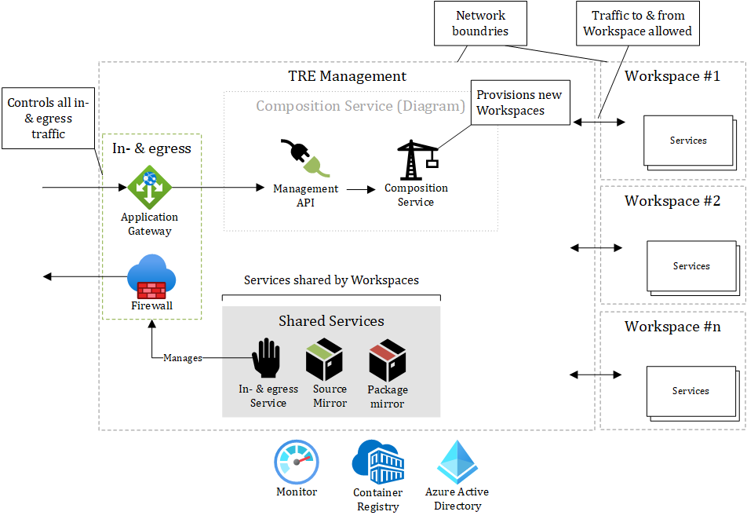
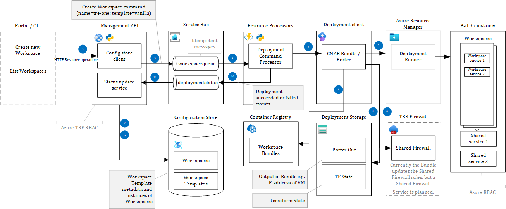

# Azure TRE Architecture

The Azure Trusted Research Environment (TRE) consists of multiple components, all encapsulated in networks with restricted ingress- & egress traffic.

There is one network for the core components and one network per Workspace.

All traffic has to be explicitly allowed by the Application Gateway or the Firewall.

[](../assets/archtecture-overview.png)

The Azure resources outside the network boundries of the Azure TRE are Microsoft Entra ID, Microsoft Graph and TRE Management. TRE Management are resources used during deployment.

The Azure TRE core plane consists of two groups of components:

- API & Composition Service
- Shared Services

The TRE API is a service that users can interact with to request changes to workspaces e.g., to create, update, delete workspaces and workspace services inside each workspace. The Composition Service is doing the actual work of mutating the state of each Workspace including the Workspace Services.

Ingress/egress components governs all inbound and outbound traffic from the public Internet to and from Azure TRE including the Workspaces. The Firewall Service is managing the egress rules of the Firewall.

Shared Services are services available to all Workspaces. **Source Mirror** can mirror source repositories such as GitHub, but only allowing read-access, hence data from a Workspace cannot be pushed to a source repository.
**Package Mirror** is also a read-only front for developer/researcher application package services like NPM, PyPI, and NuGet and operating system application package services like apt-get and Windows Package Manager (winget).

## Azure Resources

The following diagram shows the Azure components deployed as part of a typical TRE deployment. The exact configuration will vary depending on the specific deployment.

[](../assets/architecture-azure.png)

For a full breakdown of Azure Resources see [Azure TRE Resources Breakdown](tre-resources-breakdown.md)

## Composition Service

The Composition Service is responsible for managing and mutating Workspaces and Workspace Services. It consists of multiple components:

| Component Name | Responsibility / Description |
| --- | --- |
| [TRE API](../tre-developers/api.md) | An API responsible for performing all operations on Workspaces and managing Workspace Templates. |
| Configuration Store | Keeping the state of Workspaces and Workspace Templates. The store uses [Cosmos DB (SQL)](https://docs.microsoft.com/en-us/azure/cosmos-db/introduction). |
| Service Bus | [Azure Service Bus](https://docs.microsoft.com/en-us/azure/service-bus-messaging/service-bus-messaging-overview) responsible for reliable delivery of messages between components.  |
| [Resource Processor](../tre-developers/resource-processor.md) | Responsible for starting the process of mutating a Workspace via a Workspace Template. |

A Workspace is an instance of a Workspace Template. A Workspace Template is implemented as a [Porter](https://porter.sh/) bundle - read more about [Authoring workspaces templates](../tre-workspace-authors/authoring-workspace-templates.md).

A Porter bundle is a fully encapsulated versioned bundle with everything needed (binaries, scripts, IaC templates etc.) to provision an instance of Workspace Template.

To automate Porter it needs a place to live in Azure TRE. The home chosen for Porter to run was a Linux virtual machine. This Azure TRE component encompassing Porter and its dependencies is called **Resource Processor**.

[](../assets/resource-processor-overview.jpg)

<!-- markdownlint-disable MD013 -->
During the deployment of Resource Processor itself it is given the credentials of a managed identity with the privileges to modify and deploy resources to the subscription associated with the Azure TRE instance. Resource Processor then uses these credentials to receive and send Service Bus messages, authorizes Porter to access its state (stored in Cosmos-MongoDB) and deploy bundles.
<!-- markdownlint-enable MD013 -->

The logic in Resource Processor is written in Python. The Resource Processor implementation is located in [`resource_processor` folder](https://github.com/microsoft/AzureTRE/blob/main/resource_processor/) of the repository.

The [TRE Administrator](user-roles.md#tre-administrator) can register a Porter bundle that will be used to provision instances of bundle (template).

This requires:

1. The Porter bundle to be pushed to the Azure Container Registry (ACR).
1. Registering the Template through the API.

Details on how to [register a Template](../tre-admins/registering-templates.md).

## Provisioning a Workspace

[](../assets/composition-service.png)

The flow to provision a Workspace is as follows (the flow is the same for all kinds of mutations to a Workspace):

1. TRE Admin sends an HTTP request to the TRE API to create a new Workspace. The request contains information like the name of the Workspace, the Workspace Template to use, and the parameters required for the Workspace Template (Workspace Templates can expose the parameters via a JSON Schema ).
1. The API saves the desired state of the Workspace in the Configuration Store.
1. The API sends a command message with the Workspace Template reference and parameters to the `workspacequeue`.

    ```JSON
    {
            "action": "install",
            "id": "base",
            "name": "BaseWorkspaceTemplate",
            "version": "1.0",
            "parameters": {
                "param1": "value1"
            }
        }
    ```

1. The Resource Processor picks up the new message from the service bus queue.
1. The Resource Processor processes the command by executing the Porter bundle (the implementation of a Workspace Template).

    ```bash
    # simplified for readability
    porter <action> --reference <ACR name>.azurecr.io/bundles/<name>:<version> --params key=value --cred <credentials set name>

    # Example
    porter install --reference msfttreacr.azurecr.io/bundles/BaseWorkspaceTemplate:1.0 --params param1=value1 --cred arm_auth
    ```

    Deployments are carried out against the Azure Subscription using a User Assigned Managed Identity. The `arm_auth_local_debugging.json` tells Porter where the credential information can be found and for the Resource Processor they are set as environment variables.

    Porter bundle actions are required to be idempotent, so if a deployment fails, the Resource Processor can retry.

1. The Porter Docker bundle is pulled from the Azure Container Registry (ACR) and executed.
1. The Porter bundle executes against Azure Resource Manager to provision Azure resources. Any kind of infrastructure of code frameworks like ARM, Terraform, or Pulumi can be used or scripted via PowerShell or Azure CLI.
1. Porter stores state (like outputs) in Cosmos-MongoDB.
1. The Resource Processor sends events to the `deploymentstatus` queue on status changes and informs if the deployment succeeded or failed.
1. The API receives the status of the Porter bundle execution.
1. The API updates the status of the Porter bundle execution in the Configuration Store.
