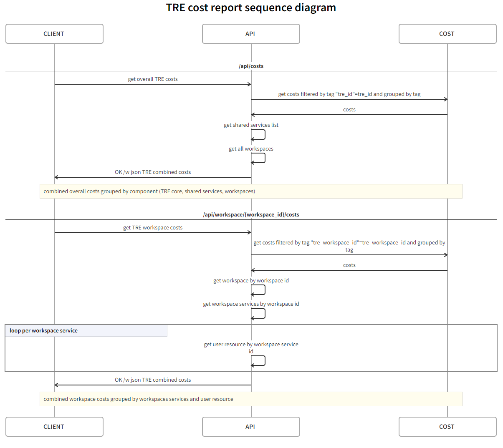

# Cost Reporting

The exact running costs will depend on the number of workspaces you have deployed, the workspace services you have enabled within them and the Azure Data center region. TRE users can use the Azure TRE cost API to get a report of the running costs of TRE resources according to their role.

TRE provides a set of cost APIs which generates costs reports by custom timeframe, and level of details according to user's role.

Cost APIs are based on [Azure Cost Management](https://docs.microsoft.com/en-us/azure/cost-management-billing/) and [TRE Templates azure resource tagging](#azure-resources-tagging), Azure resources must be tagged when authoring new template.

## Cost APIs

| Method | Endpoint | Description | Allowed Roles | Level of details |
| --- | --- | --- | --- | --- |
| GET | /api/costs | Get overall costs of a TRE Instance | TRE Admin | Core services, Shared services, workspaces |
| GET | /api/workspace/{workspace\_id}/costs | Get workspace costs | TRE Admin, Workspace Owner | Workspace, workspace services, user resources |


## Get overall cost report

**Description**

Get overall cost report for TRE instance (core services), per shared services and per workspace

**Authorization**

Only TRE Admin can call this url, others will get unauthorized

**Endpoint**

GET /api/costs

**Query Parameters**

| Parameter name| Type| Description| Default Value |
| --- | --- | --- | --- |
| from, to | datetime | Custom time period, up to 1 year timeframe, iso-8601 format | Month to date period |
| granularity| Enum (Daily, None) | The granularity of rows in the query. | None |

**Output**

```json
{
    "coreServices": [
        {"date":"", "cost":"", "currency":""} 
        ],
    "sharedServices": [ {
        "id":"shared service id",
        "name":"shared service name",
        "costs": [
            {"date":"", "cost":"", "currency":""} 
            ]
        }],
    "workspaces": [ {
        "id": "workspace id",
        "name": "workspace name", 
        "costs":[
            {"date":"", "cost":"", "currency":""} 
            ]}
        ]
}
```

## Get workspace cost report
**Description**

Get overall cost report for a specific workspace

**Authorization**

Only TRE Admin and the workspace owner can call this url, others will get unauthorized

**Input**

GET /api/workspaces/{workspace_id}/costs

**Query Parameters**

| Parameter name| Type| Description| Default Value |
| --- | --- | --- | --- |
| from, to | datetime | Custom time period, up to 1 year timeframe, iso-8601 format | Month to date period |
| granularity| Enum (Daily, None) | The granularity of rows in the query. | None |
| workspace_id |Guid |The workspace id to generate report for | Required field for workspace and user resource level apis |

**Output**
```json
{
      "id": "workspace id",
      "name": "workspace name", 
      "workspaceServices":[{
        "id": "workspace service id",
        "name": "workspace service name", 
          "costs":[{"date":"", "cost":"", "currency":""}], 
          "userResources":[{
            "id": "user resource id",
            "name": "user resource name", 
            "costs":[{"date":"", "cost":"", "currency":""}], 
          }]
        }]
}
```

## Sequence Diagram

[source](https://swimlanes.io/u/D8oktWo4j?rev=4)

[](../assets/cost-reporting-sequence-diagram.png)


## Limitations and notes

* Cost and usage data is typically available in Cost Management within 8-24 hours.

* Tags aren't applied to historical data, template authors need to make sure all relevant [Azure resources of a TRE resource are tagged as instructed](#azure-resources-tagging).

* Cost records might include [multiple currencies](https://azure.microsoft.com/en-us/blog/azure-cost-management-updates-july-2019/#currency) for the same date and TRE resource.

* Once cost data becomes available in Cost Management, it will be retained for at least seven years. Only the last 13 months is available from the TRE Cost API and Azure Portal. For historical data before 13 months, please use [Exports](https://docs.microsoft.com/en-us/azure/cost-management-billing/costs/tutorial-export-acm-data?tabs=azure-portal) or the [UsageDetails API](https://docs.microsoft.com/en-us/rest/api/consumption/usage-details/list?tabs=HTTP).

* There are several Azure Offers that currently are not supported yet, Azure Offers are types of Azure subscriptions, for full list of supported and unspported Azure Offers please refer to [Supported Microsoft Azure offers](https://learn.microsoft.com/en-us/azure/cost-management-billing/costs/understand-cost-mgt-data#supported-microsoft-azure-offers),
Azure TRE will not display costs for unsupported Azure subscriptions.

* For more information please refer to [Understand Cost Management data](https://docs.microsoft.com/en-us/azure/cost-management-billing/costs/understand-cost-mgt-data) and Cost API swagger docs.


## Azure Resources Tagging

TRE Cost Reporting is based on Azure tagging to be able to generate cost report for core services, shared services, workspace, workspace services and user resources.
Templates authors need to make sure that underling Azure resources are tagged with the following tags:


| <div style="width:160px">Tag</div> | Value | Applies to |
| ---------------------------------- | ----- | ---------- |
| `tre_id` | Unique ID of the TRE instance | All resources of a TRE instance |
| `tre_core_service_id` | Unique ID of the TRE instance | All TRE core azure resources |
| `shared_service_id` | The shared service unique ID | Shared Services |
| `workspace_id` | The workspace unique ID | Workspaces, Workspace Services and User Resources |
| `workspace_service_id` | The workspace service unique ID | Workspace Services and User Resources |
| `user_resource_id` | The user resoruce unique ID | User Resources |

!!! Notes
    - Main Azure Container Registry and Storage Account are not be tagged as those resources are used to spin up more than one Azure TRE Instance.
    - There are some cases in which azure resources cannot get tagged by template author due to different reasons, for example services get deployed outside of TRE (Example being Cyclecloud or Cromwell on Azure), or services which doesn't support tagging for cost management (for example Azure ML compute). [for the full list of tag support of Azure see this article](https://learn.microsoft.com/en-us/azure/azure-resource-manager/management/tag-support).

[](../assets/resource-tagging-example.png)


## TRE Cost API Logic

Cost management query API, which Azure TRE Cost APIs are based upon, returns a flat result of all cost with every tag combination which exists on the filtered resources by the provided tag, meaning that a resource which has tre_id, tre_core_service_id, tre_workspace_id, tre_workspace_service_id, and tre_user_resource_id will get be summarized by all those tags.
if filtered resources have more tags, those tags will appear in the result.

To rollup untagged resources into workspace costs Azure TRE cost API first calls Azure Resource Manager to get all resource group names which are tagged with the workspace_id and passes those names into Azure Cost Management Query API as a filter and group by resource group along with the tag name.
untagged costs results will apear in with an empty tag name and get aggregated using the resource group and relevent the workspace id.

Azure TRE Cost API joins this response with the hierarchical structure of the requested report.

**Cost management query API Request example**

```text
@SUBSCRIPTION = FILL_YOUR_SUBSCRIPTION_ID
@COST_API_URI = https://management.azure.com/subscriptions/{{SUBSCRIPTION}}/providers/Microsoft.CostManagement
@COST_API_VERSION = 2021-10-01
@TRE_ID = mytre
@TIME_FROM = MM/DD/YYYY
@TIME_TO = MM/DD/YYYY

POST {{COST_API_URI}}/query?api-version={{COST_API_VERSION}}&$expand=properties/data
Authorization: {{$aadToken $aadV2TenantId}}
Content-Type: application/json
```

Payload
```json
{
    "type": "ActualCost",
    "timeframe": "Custom", // can be also BillingMonthToDate|MonthToDate|TheLastBillingMonth|TheLastMonth|WeekToDate according to input
    "timePeriod": {
        "from": "{{TIME_FROM}}",
        "to": "{{TIME_TO}}"
    },
    "dataset": {
        "granularity": "None", // can be also "Daily" for total costs
        "aggregation": {
            "totalCost": {
                "name": "PreTaxCost", // can be also 'UsageQuantity','Cost','CostUSD','PreTaxCostUSD' (up to two aggregations)
                "function": "Sum"
            }
        },
       "filter": {
            "or": [
                {
                    "dimensions": {
                        "name": "ResourceGroup",
                        "operator": "In",
                        "values": ["{{RG_NAME}}"]
                }
                },
                {
                    "tags": {
                        "name": "{{TAG_KEY}}",
                        "operator": "In",
                        "values" : [
                            "{{TAG_VALUE}}",
                            ]
                    }
                }
            ]
        },
        "grouping": [
            {
                "type": "Dimension",
                "name": "ResourceGroup"
            },
            {
                "type": "Tag",
            }
        ]
    }
}
```

Response

```json
{
  "id": "subscriptions/xxxxxxxxxxxxx/providers/Microsoft.CostManagement/query/ec1f0eae-9343-4f4e-a0c0-dd219a66efc4",
  "name": "ec1f0eae-9343-4f4e-a0c0-dd219a66efc4",
  "type": "Microsoft.CostManagement/query",
  "location": null,
  "sku": null,
  "eTag": null,
  "properties": {
    "nextLink": null,
    "columns": [
      {
        "name": "PreTaxCost",
        "type": "Number"
      },
      {
        "name": "ResourceGroup",
        "type": "String"
      },
      {
        "name": "Tag",
        "type": "String"
      },
      {
        "name": "Currency",
        "type": "String"
      }
    ],
     "rows": [
      [
        0.00055748658857886549,
        "rg-mytre",
        "",
        "USD"
      ],
      [
        3.9306515711531222,
        "rg-mytre",
        "\"tre_core_service\":\"mytre\"",
        "USD"
      ],
      [
        11.66335497490112,
        "rg-mytre",
        "\"tre_id\":\"mytre\"",
        "USD"
      ],
      [
        0.033,
        "rg-mytre",
        "\"tre_shared_service\":\"2fea\"",
        "USD"
      ],
      [
        3.62175702964083,
        "rg-mytre",
        "\"tre_shared_service\":\"4a5b\"",
        "USD"
      ],
      [
        0.093523886643774659,
        "rg-mytre-ws-5e86",
        "\"tre_user_resource_id\":\"126d\"",
        "USD"
      ],
      [
        0.078465743393993009,
        "rg-mytre-ws-5e86",
        "\"tre_user_resource_id\":\"2627\"",
        "USD"
      ],
      [
        0.20275980676694544,
        "rg-mytre-ws-5e86",
        "\"tre_user_resource_id\":\"319e\"",
        "USD"
      ],
      [
        0.17165788614506686,
        "rg-mytre-ws-af30",
        "\"tre_user_resource_id\":\"3370\"",
        "USD"
      ],
      [
        0.17518017912599823,
        "rg-mytre-ws-af30",
        "\"tre_user_resource_id\":\"b2be\"",
        "USD"
      ],
      [
        0.00015748658857886549,
        "rg-mytre-ws-5e86",
        "",
        "USD"
      ],
      [
        0.39905729127776768,
        "rg-mytre-ws-5e86",
        "\"tre_workspace_id\":\"5e86\"",
        "USD"
      ],
      [
        0.98272254462049369,
        "rg-mytre-ws-af30",
        "\"tre_workspace_id\":\"af30\"",
        "USD"
      ],
      [
        0.17198963003776765,
        "rg-mytre-ws-5e86",
        "\"tre_workspace_service\":\"8d0a\"",
        "USD"
      ],
      [
        0.54959787203801058,
        "rg-mytre-ws-af30",
        "\"tre_workspace_service\":\"e70d\"",
        "USD"
      ]
    ]
  }
}
```
