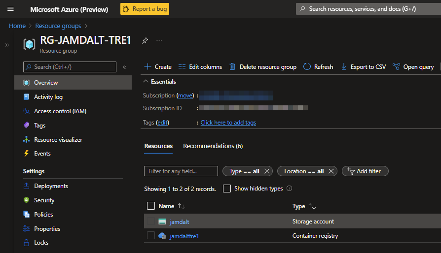

# Azure TRE Resource Breakdown

The Azure services deployed within an Azure TRE are described below.

Once an Azure TRE has been [provisioned](../../tre-admins/setup-instructions/manual-pre-deployment-steps) in an Azure Subscription, you will have two Resource Groups:

1. Azure TRE Management Resource Group - Prerequisite for deploying an Azure TRE instance
1. Azure TRE Resource Group - Core Azure TRE instance

## Azure TRE Management Resource Group

| Name | Azure Service | Description | Additional links
|---|---|---|---|
| {MGMT_STORAGE_ACCOUNT_NAME} | Storage Account | [Azure TRE Terraform](../../tre-admins/setup-instructions/manual-pre-deployment-steps)  | [Storage Blobs](https://docs.microsoft.com/en-us/azure/storage/blobs/storage-blobs-overview)
| {ACR_NAME} | Container Registry | [Azure TRE container images (Porter bundles)](../architecture/#composition-service) | [Container Registry](https://docs.microsoft.com/en-gb/azure/container-registry/container-registry-intro)

## Azure TRE Resource Group

| Name | Azure Service | Description | Additional links
|---|---|---|---|
| api-{TRE_ID} | App Service | [Azure TRE Python API](../../tre-developers/api) responsible for all operations on Workspaces and managing Workspace Templates built using the FastAPI framework | [FastAPI](https://fastapi.tiangolo.com/) |
| gitea-{TRE_ID} | App Service | [Azure TRE Source Mirror](../shared-services/gitea) - allows mirroring git repositories | [Gitea](https://gitea.io/)
| nexus-{TRE_ID} | App Service | [Azure TRE Package Mirror](../shared-services/nexus) - allows mirroring packages | [Sonatype Nexus](https://www.sonatype.com/products/repository-oss)
| plan-{TRE_ID} | App Service Plan | Compute resources in which the TRE app services run | [App Hosting plans](https://docs.microsoft.com/en-us/azure/app-service/overview-hosting-plans)
| agw-{TRE_ID} | Azure Application Gateway | [Azure TRE App Gateway](../architecture) provides a single public IP address with SSL for accessing core TRE resources | [Azure Application Gateway](https://docs.microsoft.com/en-us/azure/application-gateway/overview)
| appi-{TRE_ID} | Application Insights | Telemetry for all API invocations | [Application Insights](https://docs.microsoft.com/en-us/azure/azure-monitor/app/app-insights-overview)
| cosmos-{TRE_ID} | Azure Cosmos DB Account | NoSQL state store of TRE resources, templates and operations | [Cosmos DB](https://docs.microsoft.com/en-us/azure/cosmos-db/introduction)
| mysql-{TRE_ID} | Azure Database for MySQL server | SQL state store for Gitea | [Gitea Database](https://docs.gitea.io/en-us/database-prep)
| ampls-{TRE_ID} | Azure Monitor Private Link Scope | Provides secure link between PaaS resources and the TRE vnet using private endpoints | [Azure Monitor Private Link Scope](https://docs.microsoft.com/en-us/azure/azure-monitor/logs/private-link-security)
| bas-{TRE_ID} | Azure Bastion | Provides secure access for RDP/SSH to TRE VM (jumpbox) | [Azure Bastion](https://docs.microsoft.com/en-us/azure/bastion/bastion-overview)
| vm-dsk-{TRE_ID} | Disk | Managed storage disk for TRE VM (jumpbox) | [Managed Disks](https://docs.microsoft.com/en-us/azure/virtual-machines/managed-disks-overview)
| fw-dsk-{TRE_ID} | Azure Firewall | [Azure TRE Firewall](../networking) restricts external outbound traffic from all TRE resources | [Azure Firewall](https://docs.microsoft.com/en-us/azure/firewall/overview)
| kv-{TRE_ID} | Azure Key Vault | Management of TRE secrets & certificates | [Azure Key Vault](https://docs.microsoft.com/en-us/azure/key-vault/general/overview)
| log-{TRE_ID} | Log Analytics Workspace | Azure Monitor Logs store for all TRE resources | [Log Analytics](https://docs.microsoft.com/en-us/azure/azure-monitor/logs/data-platform-logs#log-analytics-workspaces)
| id-agw-{TRE_ID} | Managed Identity | User-managed identity for TRE Application Gateway | [Managed Identities](https://learn.microsoft.com/en-us/entra/identity/managed-identities-azure-resources/overview)
| id-api-{TRE_ID} | Managed Identity | User-managed identity for TRE API App Service | [Managed Identities](https://learn.microsoft.com/en-us/entra/identity/managed-identities-azure-resources/overview)
| id-gitea-{TRE_ID} | Managed Identity | User-managed identity for TRE Gitea App Service | [Managed Identities](https://learn.microsoft.com/en-us/entra/identity/managed-identities-azure-resources/overview)
| id-vmss-{TRE_ID} | Managed Identity | User-managed identity for TRE Resource Processer (VMSS) | [Managed Identities](https://learn.microsoft.com/en-us/entra/identity/managed-identities-azure-resources/overview)
| sb-{TRE_ID} | Service Bus Namespace | Messaging for TRE API | [Service Bus](https://docs.microsoft.com/en-us/azure/service-bus-messaging/service-bus-messaging-overview)
| stappinsights{TRE_ID} | Storage Account | Storage for TRE Application Insights telemetry logs | [Storage Blobs](https://docs.microsoft.com/en-us/azure/storage/blobs/storage-blobs-overview)
| stg{TRE_ID} | Storage Account | Files shares for TRE services such as Gitea, Nexus | [Storage Files](https://docs.microsoft.com/en-us/azure/storage/files/storage-files-introduction)
| stweb{TRE_ID} | Storage Account | Storage for [Azure TRE Let's Encrypt](../../tre-admins/setup-instructions/deploying-azure-tre) | [Storage Blob](https://docs.microsoft.com/en-us/azure/storage/blobs/storage-blobs-overview)
| vm-{TRE_ID} | Virtual Machine | [Azure TRE VM (jumpbox)](https://microsoft.github.io/AzureTRE/tre-admins/setup-instructions/configuring-shared-services) | [Windows Virtual Machine](https://docs.microsoft.com/en-us/azure/virtual-machines/windows/overview)
| vm-{TRE_ID} | Virtual Machine Scale Set | [Azure TRE Resource Processor](../../tre-developers/resource-processor) | [Virtual Machine Scale Sets](https://docs.microsoft.com/en-us/azure/virtual-machine-scale-sets/overview)
| vnet-{TRE_ID} | Virtual Network | [Azure TRE VNET central hub](../networking) | [Virtual Networks](https://docs.microsoft.com/en-us/azure/virtual-network/virtual-networks-overview)
| rt-{TRE_ID} | Route Table | Azure TRE route table | [Route Tables](https://docs.microsoft.com/en-us/azure/virtual-network/manage-route-table)

!!! note
    Network resources such as Network Interfaces, Network Security Groups, Private Endpoints, Private DNS zones and Public IP addresses are not listed above.

## Azure TRE Workspace Resource Group

A TRE Workspace will be provisioned in a separate Resource Group along with its own resources.  An example TRE Workspace is shown and described here.

| Name | Azure Service | Description | Additional links
|---|---|---|---|
| guacamole-{TRE_ID}-ws-XXXX-svc-XXXX | App Service | [RDP](../../tre-templates/workspace-services/guacamole) for accessing workspace VMs | [Apache Guacamole](https://guacamole.apache.org)
| kv-{TRE_ID}-ws-XXXX | Azure Key Vault | Management of TRE workspace secrets & certificates | [Azure Key Vault](https://docs.microsoft.com/en-us/azure/key-vault/general/overview)
| osdisk-windowsvm8f45 | Disk | Azure VM storage disk | [Managed Disks](https://docs.microsoft.com/en-us/azure/virtual-machines/managed-disks-overview)
| plan-09d0ba4f-f79f-4047-aa2c-03fc9df7b318 | App Service plan | Compute resources in which the workspace app services (Gitea) run | [App Hosting Plans](https://docs.microsoft.com/en-us/azure/app-service/overview-hosting-plans)
| stgwsb318 | Storage account | Workspace Storage account | [Storage Blobs](https://docs.microsoft.com/en-us/azure/storage/blobs/storage-blobs-overview)
| vnet-{TRE_ID}-ws-XXXX | Virtual Network | [Azure TRE VNET spoke](../networking) | [Virtual Networks](https://docs.microsoft.com/en-us/azure/virtual-network/virtual-networks-overview)
| windowsvm8f45 | Virtual Machine | [Windows VM instance](../../tre-templates/user-resources/guacamole-windows-vm) for research | [Windows Virtual Machine](https://docs.microsoft.com/en-us/azure/virtual-machines/windows/overview)

!!! note
    Network resources such as Network Interfaces, Network Security Groups and Private Endpoints are not listed above.
