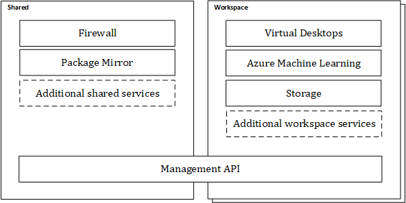

# Concepts

Trusted Research Environments enforce a secure boundary around distinct workspaces to enable information governance controls to be enforced. Each workspace is accessible by a set of authorized users, prevents the exfiltration of sensitive data, and has access to one or more datasets provided by the data platform.

One or more workspace services are deployed into a workspace to provide resources accessible by the workspace users.

The workspaces and the services can be deployed and managed via the Management API.

## Workspace

A workspace is a set of resources on a network with inbound traffic restricted to authorised users and outbound access restricted to defined network locations. The workspace is a security boundary in the fact there should be zero transfer of data outside of the workspace unless explicitly configured. Data transfer is not restricted within a workspace.

Workspaces can be configured with a variety of tools to enable tasks such as the development of machine learning models, data engineering, data analysis, and software development.

Multiple workspaces can be created within a single Trusted Research Environment to create the required separation for your projects.

## Service

A service provide one or more capabilities to you as a user of the TRE or to the TRE itself.  Depending on the type of the service it is scoped to the environment and shared across all workspaces or scoped to a specific workspace.

The types of services required for a research project varies greatly why extensibility is a key aspect of the Azure TRE solution so new services can be developed by you and your organization to fit your needs.

Some workspace services are accessible from outside the protected network, such as a Virtual Desktop. But no data will be permitted to be transferred outside the protected network. Others such as Azure Machine Learning might need access restricting to via a Virtual Desktop.

Below are examples of services that are available in the Azure TRE solution.

### Shared services

- Firewall
- Python Package Mirror
- Git Mirror

### Workspace services

- Virtual Desktop
- Azure Machine Learning

## Workspace Service Resources

Some workspace services allow users to create their own instances of the resources provided by the service in the current workspace. For example, the Virtual Desktop service allow each user to deploy their own virtual machines with remote access and storage.

## Management API

The Management API is an HTTP API surface that allows you to provision and manage workspaces and services within the TRE. By using the Management API you can integrate the TRE services lifecycle into your workflows and provide access to the services from your custom applications.
