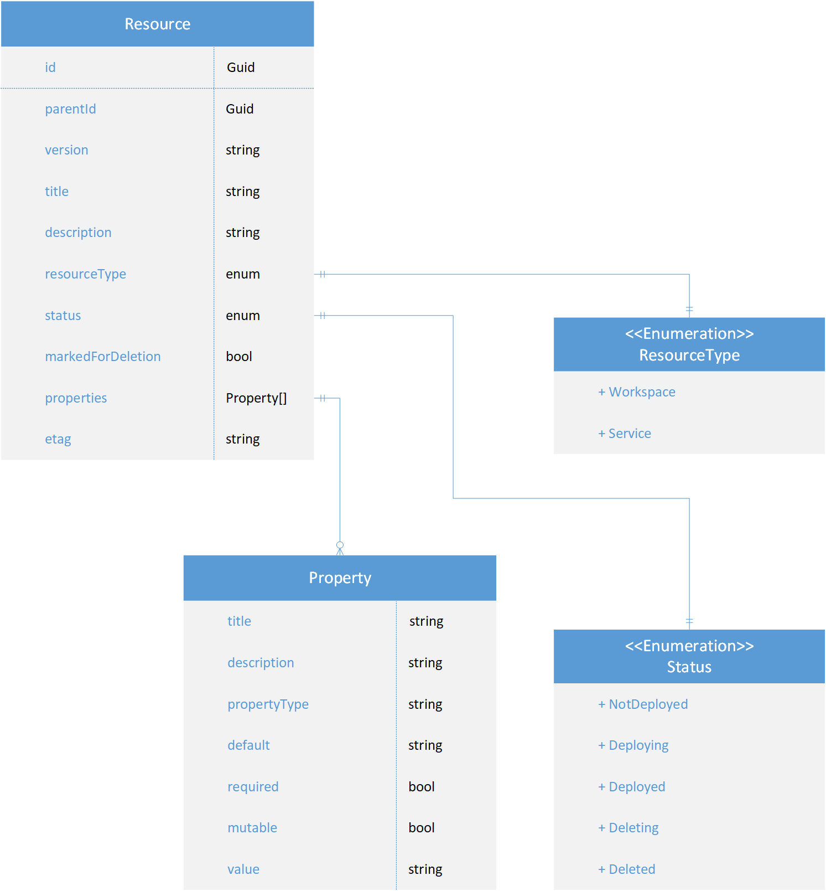
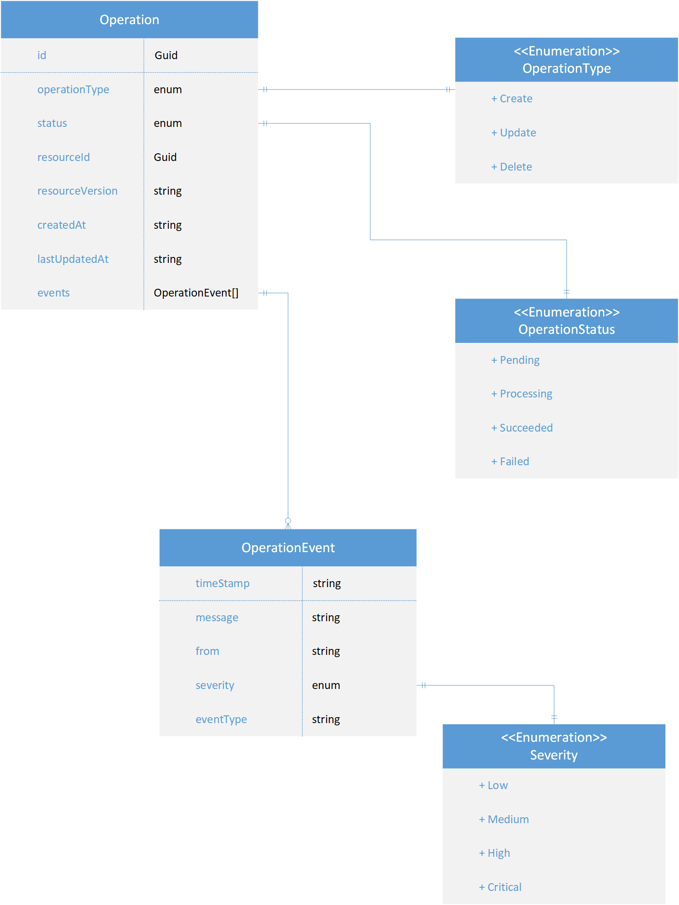

# Logical data model

## Resource

| Key | Value description |
| --- | ----------------- |
| `id` | A unique resource id. |
| `parentId` | The parent resource id. |
| `specificationVersion` | Resource specification version. |
| `resourceVersion` | Resource version. |
| `title` | The name (title) of the resource. Rendered in the UI. |
| `description` | The description of the resource. Rendered in the UI. |
| `resourceType` | Resource type. Workspace or Service. |
| `status` | Resource status. |
| `isDeleted` | Is the resource marked for deletion. |
| `properties` | Resource properties list.|
| `etag` | The resource etag. |

### Property

| Key | Value description |
| --- | ----------------- |
| `title` | The name (title) of the variable. Rendered in the UI. |
| `description` | The description of the variable. Rendered in the UI. |
| `propertyType` | The type of the variable value. |
| `default` | *(Optional)* The default value of the variable. |
| `required` | *(Optional)* A boolean value defining whether a value is required or not. `true` by default. |
| `mutable` | *(Optional)* A boolean value defining whether the variable can be changed by the end-user or not. `true` by default. |
| `value` | The variable value (when populated in the state store). |

## Resource assignment

| Key | Value description |
| --- | ----------------- |
| `id` | A unique assignment id. |
| `userId` | User id. |
| `resourceId` | Resource id. |
| `permissions` | Granted permissions. |

### Permissions

| Key | Value description |
| --- | ----------------- |
| `WorkspaceWrite` | Permission to write a workspace. |
| `WorkspaceRead` | Permission to read a workspace. |
| `WorkspaceDelete` | Permission to delete a workspace. |
| `WorkspaceCreateService` | Permission to create a service. |
| `WorkspaceUserRead` | Permission to read workspace users. |
| `WorkspaceUserManage` | Permission to manage workspace users. |
| `ServiceRead` | Permission to read a service. |
| `ServiceWrite` | Permission to write a service. |
| `ServiceDelete` | Permission to delete a service. |

## Operation

| Key | Value description |
| --- | ----------------- |
| `id` | A unique operation id. |
| `operationType` | Operation type (Create, Update, Delete). |
| `status` | Operation status. |
| `resourceId` | Resource id. |
| `resourceVersion` | Resource version. |
| `createdAt` | Time when operation was created. |
| `lastUpdatedAt` | Time when operation was last updated. |
| `events` | Operation events. |

### Operation event

| Key | Value description |
| --- | ----------------- |
| `timeStamp` | Event time stamp. |
| `message` | Event message. |
| `from` | Event originator. |
| `severity` | Severity of event. |
| `eventType` | Event type. |
