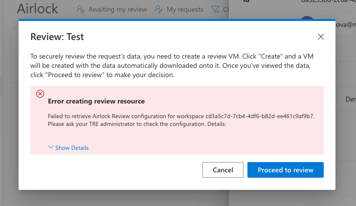

# Configuring Airlock Review feature

Airlock Review feature allows to setup a process for manually reviewing Airlock requests. When using this feature, Airlock Manager (a role with privileges of reviewing Airlock requests) is able to create Review User Resource (VM) and use it to review the data from.

For information on Airlock feature, please refer to the [overview page](../azure-tre-overview/airlock.md).

For documentation on how to review an Airlock request, please refer to the [user guide](../using-tre/tre-for-research/review-airlock-request.md).

## Pre-requisites

The feature is configured on a per Research Workspace basis. Different Research Workspaces need to be configured separately, although a single Airlock Import Workspace can be reused for all of them.

Research Workspace can only be configured after it has been deployed, and the template must be of version 0.5.0 or later.
Airlock must be enabled in the Research Workspace.

To configure the feature, the following prerequisites need to be fulfilled:

1. [Airlock Import Workspace](../tre-templates/workspaces/airlock-import-review.md) need to be deployed (once per TRE).
1. [Guacamole Workspace Service](../tre-templates/workspace-services/guacamole.md) need to be deployed in Airlock Import Workspace from the previous step.
1. [Template for import review VM](../tre-templates/user-resources/import-reviewvm.md) needs to be installed in the TRE, or a custom template if used.

1. [Guacamole Workspace Service](../tre-templates/workspace-services/guacamole.md) need to be deployed in Research Workspace.
1. [Template for export review VM](../tre-templates/user-resources/export-reviewvm.md) needs to be installed in the TRE, or a custom template if used.

## Configuring Airlock VM for Research Workspace

Navigate to Research Workspace in the UI, and click "Update". You will see a check box "Configure Review VMs".

You then will be able to input the values as follows:

1. For `Import Review Workspace ID`, use the GUID of the Import Review workspace from step 1.
1. For `Import Review Workspace Service ID`, use the GUID of the Workspace Service from step 2.
1. For `Import Review VM User Resource Template Name`, unless you have built a custom template for this, you should use `tre-service-guacamole-import-reviewvm` which is the name of the standard template used for Import Reviews from step 3.
1. For `Export Review Workspace Service ID`, use the GUID of the Workspace Service deployed into the Research Workspace from step 4.
1. For `Export Review Vm User Resource Template Name`, unless you have built a custom template for this, you should use `tre-service-guacamole-export-reviewvm` which is the name of the standard template used for Import Reviews from step 5.

Once you're done, click Submit.

Verify that the configuration is working by creating Review VMs for existing import export and export requests (configuration is not verified on update).

## Troubleshooting

### Users cannot create Review VMs

If a user sees an error when creating Review VMs, this most likely means that the configuration isn't correct.
Double-check that all GUIDs don't have any symbols missing, and the names of templates are correct.

