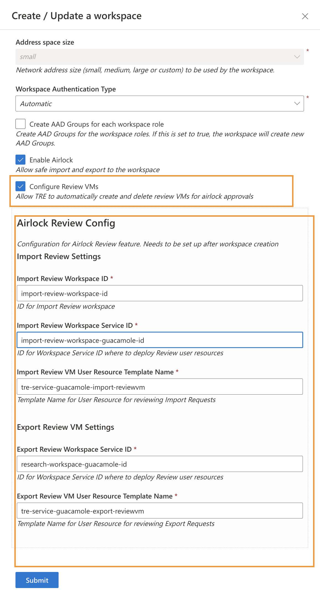

# Configuring Airlock Review feature

The Airlock Review feature enables the setup of a process for manually reviewing Airlock requests.
With this functionality, users assigned the Airlock Manager role—who have the necessary privileges to review requests—can quickly spin up a Virtual Machine. This VM is provisioned with the required access to the requested data, allowing the Airlock Manager to efficiently perform the review process in an isolated environment.

For information on Airlock feature, please refer to the [overview page](../azure-tre-overview/airlock.md).

For documentation on how to review an Airlock request, please refer to the [user guide](../using-tre/tre-for-research/review-airlock-request.md).

## Pre-requisites

The feature is configured on a per Research Workspace basis. Different Research Workspaces need to be configured separately, although a single Airlock Import Workspace can be reused for all of them.


To configure the feature, the following prerequisites need to be fulfilled:

1. A deployed Research workspace. Note that if is a base workspace, the template of the workspace must be of version 0.5.0 or later and airlock must be enabled in it.

[](../assets/enable-airlock.png)


For import:

1. [Airlock Import Workspace](../tre-templates/workspaces/airlock-import-review.md) A dedicated workspace used for import reviews. It needs to be deployed once per TRE. To make this template available in your TRE run the following make command:
```bash
make workspace_bundle BUNDLE=airlock-import-review
```

Note: TRE Admin permissions are required to register the template
Having the template in place. Deploy a new workspace using that template that will be used for Airlock import reviews.

1. [Guacamole Workspace Service](../tre-templates/workspace-services/guacamole.md) need to be deployed in Airlock Import Workspace from the previous step.

1. [Template for import review VM](../tre-templates/user-resources/import-reviewvm.md) needs to be installed in the TRE, or a custom template if used. To add the existing review VM template to your TRE run the following make command:
```bash
make user_resource_bundle WORKSPACE_SERVICE=guacamole BUNDLE=guacamole-azure-import-reviewvm
```
Note: TRE Admin permissions are required to register the template

For export:

1. [Guacamole Workspace Service](../tre-templates/workspace-services/guacamole.md) need to be deployed in Research Workspace.

1. [Template for export review VM](../tre-templates/user-resources/export-reviewvm.md) needs to be installed in the TRE, or a custom template if used. To add the existing review VM template to your TRE run the following make command:
`make user_resource_bundle WORKSPACE_SERVICE=guacamole BUNDLE=guacamole-azure-export-reviewvm`
Note: TRE Admin permissions are required to register the template


## Configuring Airlock VM for Research Workspace

To allow the Airlock Import Review feature in your workspace navigate to Research Workspace in the UI, and click "Update". You will see a check box "Configure Review VMs".

[](../assets/configure-review-vm.png)

You then will be able to input the values as follows:

1. For `Import Review Workspace ID`, use the GUID of the Airlock Import Review workspace from Pre Requisites step 1.
1. For `Import Review Workspace Service ID`, use the GUID of the Guacamole Workspace Service from step 2.
1. For `Import Review VM User Resource Template Name`, unless you have built a custom template for this, you should use `tre-service-guacamole-import-reviewvm` which is the name of the standard template used for Import Reviews from step 3.
1. For `Export Review Workspace Service ID`, use the GUID of the Guacamole Workspace Service deployed into the Research Workspace from step 4.
1. For `Export Review Vm User Resource Template Name`, unless you have built a custom template for this, you should use `tre-service-guacamole-export-reviewvm` which is the name of the standard template used for Import Reviews from step 5.

Once you're done, click Submit.

Verify that the configuration is working by creating Review VMs for existing import export and export requests (configuration is not verified on update).

For troubleshooting guidance please review [the airlock troubleshooting FAQ](../troubleshooting-faq/airlock-troubleshooting.md)

## Example

I have a research workspace called Umbrella. It was created using a base workspace template (it can be any other template or custom template) and it was it was created without configuring any airlock review properties. For the sake of example lets say the workspace id is - `research-workspace-id`

[](../assets/airlock-review/workspace-creation.png)

I have created a Guacamole workspace service inside the Umbrella workspace and called it Virtual Desktops. I will be using this Virtual Desktops service to spin up review VMs for **export**. For the sake of example lets say this workspace service id is - `research-workspace-guacamole-id`

[](../assets/airlock-review/research-workspace-guacamole-for%20export-reviews.png)

The next thing I did  is create an Airlock Import Review Workspace using Airlock Import Review Workspace template. For the sake of example lets say the workspace id is - `import-review-workspace-id`

[](../assets/airlock-review/create-airlock-import-review-workspace.png)

And inside of it I have created a Guacamole workspace service called Virtual Desktops. I will be using this Virtual Desktops service to spin up review VMs for **import**. For the sake of example lets say this workspace service id is - `import-review-workspace-guacamole-id`

[](../assets/airlock-review/airlock-import-review-workspace-guacamole.png)

Now I basically have everything in place. I can configure now the review VM properties in my Research Workspace - Umbrella. I will click update on it -

[](../assets/airlock-review/update-research-workspace.png)


And fill in the ids -


[](../assets/airlock-review/configure-properties.png)
