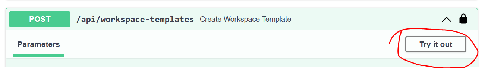

# Registering Templates

To enable users to deploy Workspaces, Workspace Services or User Resources, we need to register their Templates. This can be done wither by running `make` commands; using the API or devops scripts. In this article both approaches are described.

!!! info
    Templates are encapsulated in [Porter](https://porter.sh) bundles.

## Registration with make commands

Porter bundles can be prepared and registered with `make` commands, which can be useful for CI/CD scenarios. Before registering, Porter bundles must be built (`make bundle-build`) and then published to the TRE registry (`make bundle publish`), before finally registering it for use with the TRE using `make bundle-register`. Here we use the Azure ML workspace service bundle as an example:

```cmd
make bundle-build DIR=templates/workspace_services/azureml
make bundle-publish DIR=templates/workspace_services/azureml
make bundle-register DIR=templates/workspace_services/azureml BUNDLE_TYPE=workspace_service
```

If you're building, publishing and registering a lot of bundles, using three separate commands can be cumbersome, so there is a unifed command for each bundle type to make this easier:

```cmd
make workspace_service_bundle BUNDLE=azureml
```

There are also `make workspace_bundle`, `make shared_service_bundle` and `make user_resource_bundle` commands for the corresponding bundle resource types.

!!! tip
The `make user_resource_bundle` also requires a `WORKSPACE_SERVICE` parameter to be passed alongside `BUNDLE` which specifies the workspace service that the user resource belongs to.

## Registration using Swagger UI

Porter bundles can also be registered interactively using the Swagger UI. For that we need to build and publish the porter bundle  

1. Build the Porter bundle

   ```cmd
   make bundle-build DIR=templates/workspace_services/azureml
   make bundle-publish DIR=templates/workspace_services/azureml
   ```

1. Use the utility script to generate the payload. The script needs to be executed from within the bundle directory, for example `/templates/workspaces/base/`

   ```cmd
   ../../../devops/scripts/register_bundle_with_api.sh -r <acr_name> -t workspace --dry-run
   ```

   Copy the resulting JSON payload.

1. Navigate to the Swagger UI at `/api/docs`
1. Log into the Swagger UI using `Authorize`
1. Click `Try it out` on the `POST` `/api/workspace-templates` operation:

    

1. Paste the payload json generated earlier into the `Request body` field, then click `Execute`. Review the server response.
1. Verify the template registration using the `GET` operation on `/api/workspace-templates`. The name of the template should now be listed.

## Registration using script

To use the script to automatically register the template, you must create a user that does not require an interactive login per the [e2e test user documentation here](../tre-admins/auth.md#tre-e2e-test).

The script needs to be executed from within the bundle directory, for example `/templates/workspaces/base/`

```cmd
Usage: ../../../devops/scripts/register_bundle_with_api.sh  [-c --current]

Options:
   -r, --acr-name                Azure Container Registry Name
   -t, --bundle-type             Bundle type: workspace, workspace_service, user_resource or shared_service
   -w, --workspace-service-name  The template name of the user resource (if registering a user_resource)
   -c, --current                 Make this the currently deployed version of this template
   -v, --verify                  Verify registration with the API
```

In addition to generating the payload, the script posts the payload to the `/api/workspace-templates` endpoint. Once registered the template can be retrieved by a `GET` operation on `/api/workspace-templates`.

!!! tip
    Follow the same procedure to register workspace service templates and user resource templates
