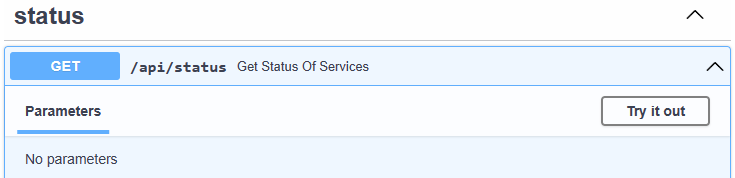

# Deploying Azure TRE

You are now ready to deploy the Azure TRE instance. Execute the `all` action of the makefile using `make`:

```bash
make all
```

Deploying a new Azure TRE instance takes approximately 30 minutes.

Once the deployment is completed, you will be presented with a few output variables similar to the ones below:

```plaintext
app_gateway_name = "agw-mytre"
azure_tre_fqdn = "mytre.westeurope.cloudapp.azure.com"
core_resource_group_name = "rg-mytre"
keyvault_name = "kv-mytre"
log_analytics_name = "log-mytre"
static_web_storage = "stwebmytre"
```

The Azure TRE instance is initially deployed with an invalid self-signed SSL certificate. This certificate needs to be replaced with one valid for your configured domain name. To use a certificate from [Let's Encrypt](https://letsencrypt.org/), run the command:

```bash
make letsencrypt
```

!!! caution
    There are rate limits with Let's Encrypt, so this should not be run when not needed.

!!! info
    If you're using Codespaces, you'll encounter a bug when trying to run `make letsencrypt` where the incorrect IP will be whitelisted on the storage account and Codespaces won't be able to upload the test file due to a 403 error. The workaround until this is fixed is to temporarily disable the firewall on your `stweb{TRE_ID}` storage account before running the script, then re-enable afterwards.

## Validate the deployment

### Using curl

Use `curl` to make a simple request to the status endpoint of the API:

```bash
curl https://<azure_tre_fqdn>/api/status
```

The expected response is:

```json
{"services":[{"service":"Cosmos DB","status":"OK","message":""}]}
```

You can also create a request to the `api/health` endpoint to verify that the API is deployed and responds. You should see a *pong* response as a result of the request below:

```cmd
curl https://<azure_tre_fqdn>/api/health
```

### Using the API docs

Open your browser and navigate to the `/api/docs` route of the API:  `https://<azure_tre_fqdn>/api/docs` and click *Try it out* on the operation of choice.



## Next steps

* [Install base workspace bundle](installing-base-workspace.md)
* Deploy a new workspace for Azure Machine Learning
* [Enable users to access the Azure TRE instance](../auth.md#enabling-users)
* [Create a new workspace template](../../tre-workspace-authors/authoring-workspace-templates.md)
* [Tear-down Azure TRE](tear-down.md)
