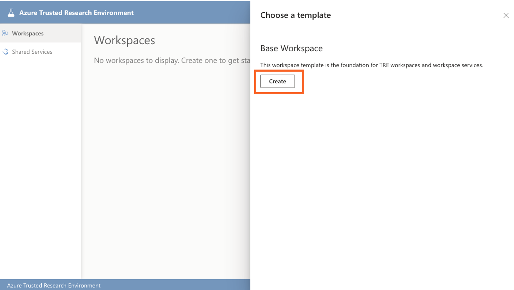
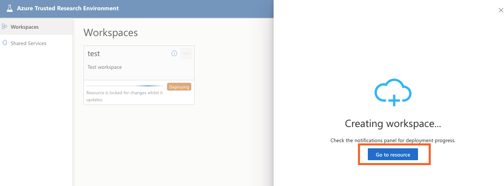

# Installing base workspace

## Publishing and registering the base workspace bundle

Run the following in a terminal to build, publish and register the base workpace bundle:

```cmd
make workspace_bundle BUNDLE=base
```

This will prepare the template for use with your TRE.

## Create Base Workspace

Workspace can be easily created via AzureTRE UI. Open a browser and navigate to: `https://<TRE_ID>.<LOCATION>.cloudapp.azure.com/` (replace TRE_ID and LOCATION with values from previous steps). It will require you to log in, make sure you login with a user who is a TREAdmin.

1. Select Workspaces -> Create New:

    

1. Click on Create under Base Workspace:

    

1. Fill in the details for your workspace:

   - General information such as name and description
   - [Optional] Update values for Shared Storage Quota, App Service Plan (SKU) and Address space if needed
   - Workspace Authentication Type - this determines whether you'd like TRE to create an app registration for the workspace automatically, or whether you with to provide an existing one that you've created manually. To read about how to create it manually read the [Creating an Application Client for base workspace](#creating-an-application-client-for-base-workspace) section below.

1. After filling the details press submit.

    

1. Select go to resource to see its status:

    

1. Navigate to Operation and wait till changed to deployed:

    

Workspace is now ready to use.


## Creating an Application Client for base workspace

As explained in the [auth guide](../auth.md), every workspace has a corresponding app registration which if you haven't run `make auth`; can be created using the helper script `./devops/scripts/aad/create_workspace_application.sh`. For example:

```bash
  ./devops/scripts/aad/create_workspace_application.sh \
    --name "${TRE_ID} - workspace 1" \
    --admin-consent \
    --ux-clientid "${SWAGGER_UI_CLIENT_ID}" \
    --automation-clientid "${TEST_ACCOUNT_CLIENT_ID}" \
    --application-admin-clientid "${APPLICATION_ADMIN_CLIENT_ID}"
```

!!! caution
    If you're using a separate tenant for Microsoft Entra ID app registrations to the one where you've deployed the TRE infrastructure resources, ensure you've signed into that tenant in the `az cli` before running the above command. See **Using a separate Microsoft Entra ID tenant** in [Setup Auth configuration](./setup-auth-entities.md) for more details.

Running the script will report `WORKSPACE_API_CLIENT_ID` and `WORKSPACE_API_CLIENT_SECRET` for the generated app. Set these under authentication section in `config.yaml` so that automated testing will work. You also need to use `WORKSPACE_API_CLIENT_ID` and `WORKSPACE_API_CLIENT_SECRET` in the form.

## Next steps

* [Installing a workspace service & user resources](./ui-install-ws-and-ur.md)
