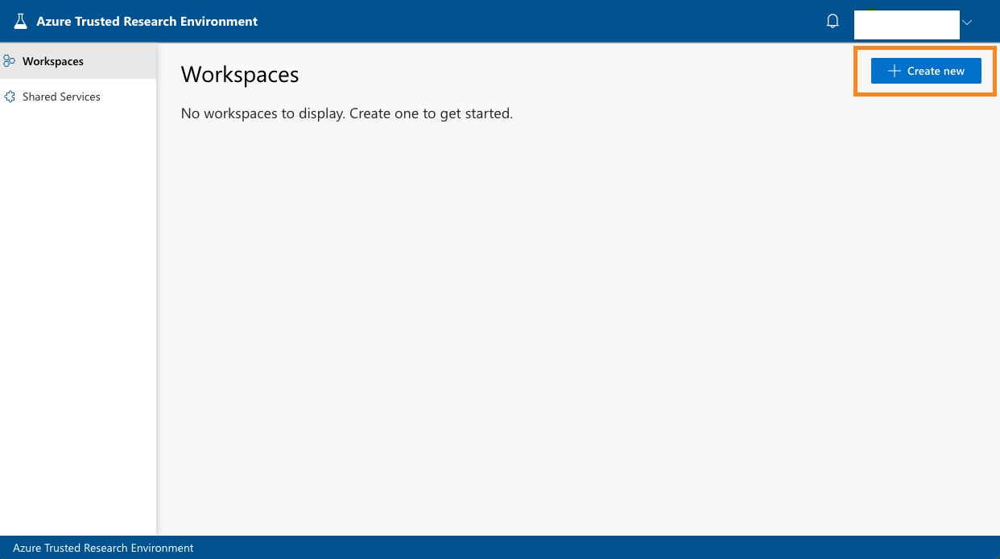
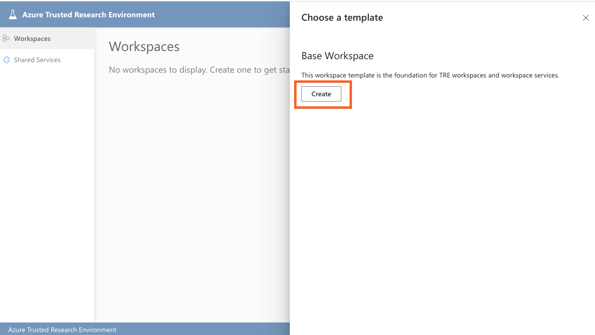
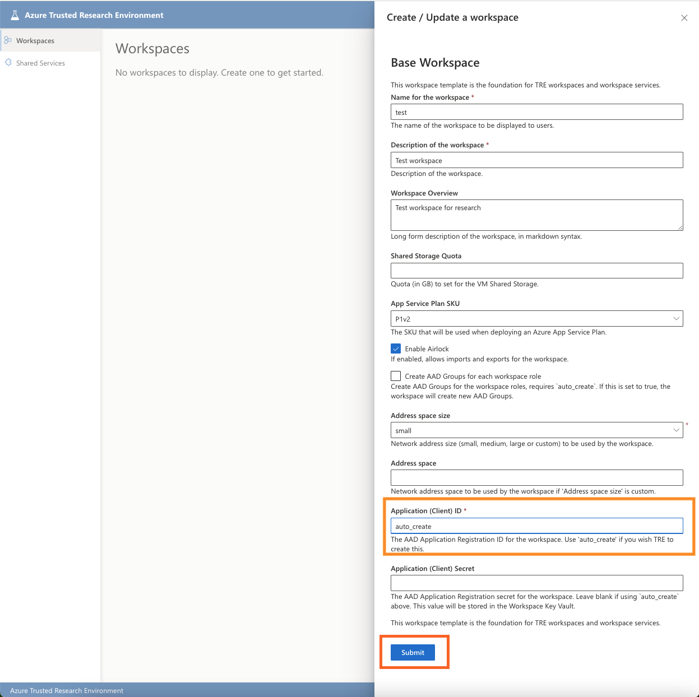
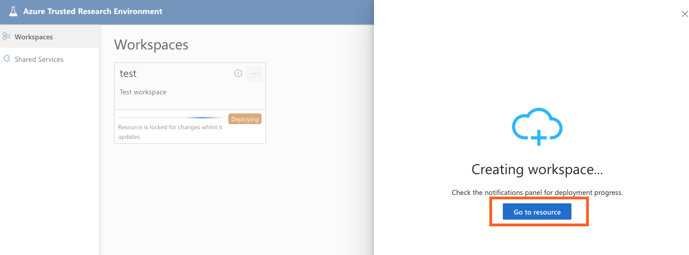
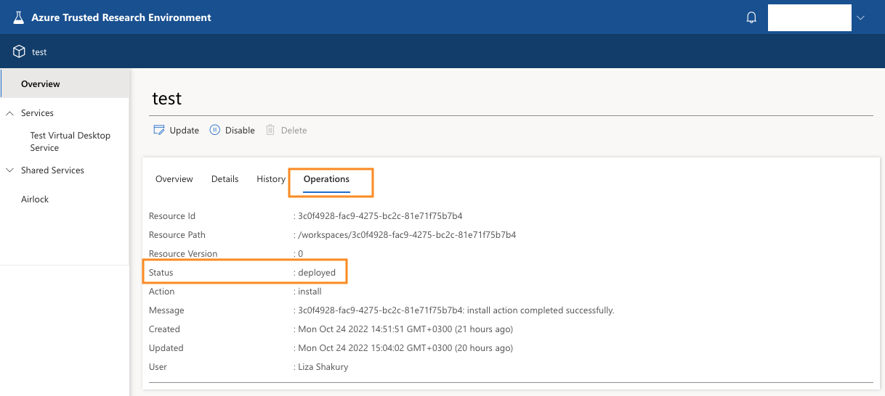

# Installing base workspace

## Publishing and registering the base workspace bundle

Run the following in a terminal to build, publish and register the base workpace bundle:

```cmd
make workspace_bundle BUNDLE=base
```

This will prepare the template for use with your TRE.

## Create Base Workspace

Workspace can be easily created via AzureTRE UI. Open a browser and navigate to: `https://<TRE_ID>.<LOCATION>.cloudapp.azure.com/` (replace TRE_ID and LOCATION with values from previous steps). It will require you to log in, make sure you login with a user who is a TREAdmin.

1. Select Workspaces -> Create New:

    

1. Click on Create under Base Workspace:

    

1. Fill in the details for your workspace:

    - General information such as name and description
    - [Optional] Update values for Shared Storage Quota, App Service Plan (SKU) and Address space if needed
    - [Optional] Application (Client) ID - leave empty (default) to have TRE automatically create and manage the workspace app registration, or provide the client ID of a pre-created Entra ID application to reuse an existing one. To create one manually read the [Creating a manual Entra ID application for the workspace](#creating-a-manual-entra-id-application-for-the-workspace) section below.

1. After filling the details press submit.

    

1. Select go to resource to see its status:

    

1. Navigate to Operation and wait till changed to deployed:

    

Workspace is now ready to use.


## Creating a manual Entra ID Application for the workspace

By default each workspace creates its own Microsoft Entra ID application. If you want to use a pre-created application instead, create it with the helper script `./devops/scripts/aad/create_workspace_application.sh` and provide its client ID when creating the workspace. For example:

```bash
  ./devops/scripts/aad/create_workspace_application.sh \
    --name "${TRE_ID} - workspace 1" \
    --application-admin-clientid "${APPLICATION_ADMIN_CLIENT_ID}"
```

## Next steps

* [Installing a workspace service & user resources](./ui-install-ws-and-ur.md)
