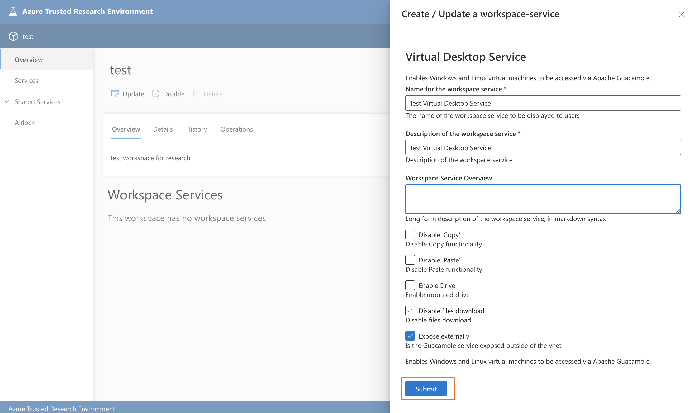
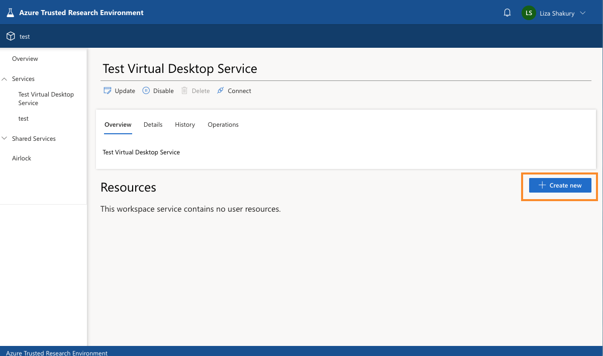
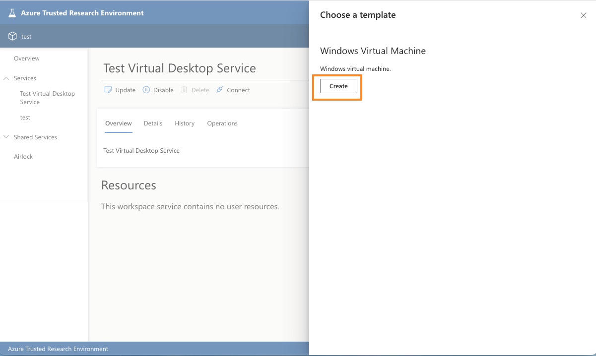

# Installing workspace service and user resource

## Publish and register a workspace service template

We will use the [Guacamole workspace service bundle](../../tre-templates/workspace-services/guacamole.md) for the purposes of this tutorial; a template that provides Virtual Desktop functionality allowing the deployment of VMs for users. These steps can be repeated for any workspace service template depending on the functionalities required.

1. Run:

    ```cmd
    make workspace_service_bundle BUNDLE=guacamole
    ```

## Publish and register a user resource template

The Guacamole workspace service also has user resources: the VMs that researchers will deploy. These steps can be repeated for any user resource template.

1. Run:

    ```cmd
    make user_resource_bundle BUNDLE=guacamole-azure-windowsvm WORKSPACE_SERVICE=guacamole
    ```

## Creating a workspace service

Now that we have published and registered both workspace service and user resource bundles we can use the UI to create a workspace service in our workspace.

1. In the UI go to the workspace you have created in the previous step and click on `Create New` under Workspace Services:

    
2. Choose the Guacamole (Vurtual Desktop) template:
    
3. Fill in the details:
    
4. Go to operations tab and wait till the status is deployed:
    

## Creating a user resource

Having published and registered the user resource bundles and a Guacamole workspace service is deployed we can now create the VM user resource the researcher can connect and work on.

To create a VM user resource follow the next steps:

1. Inside the Guacamole workspace service created in a previous step, go to Resources and click on `Create New`:
    
1. Select the VM template and click on `Create`:
    
1. Fill in the details and click on `Submit`:
    
1. Go to the reource:
    
1. Wait until the status is deployed. Once deployed you can connect to the VM:
    
