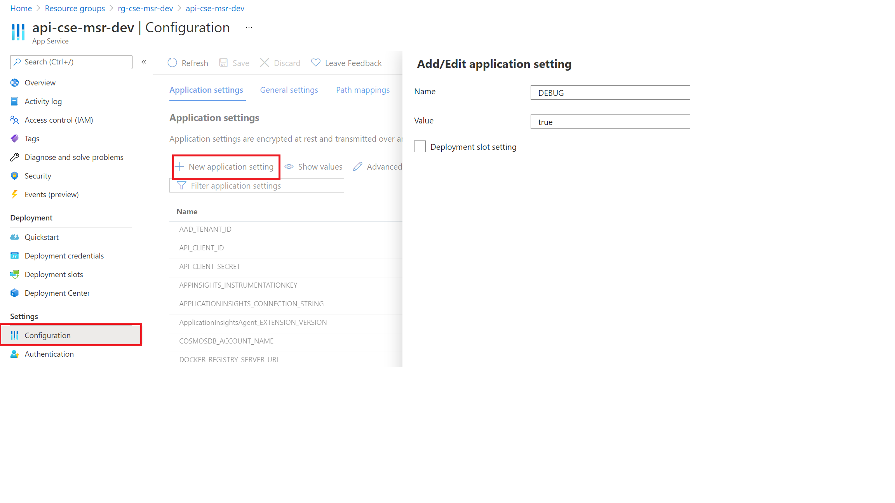

# Operations Debugging and Troubleshooting guide

This guide explains how to go about finding the root cause of why a workspace resource might not have been deployed.

The steps listed below should be followed in order as that is how the message also flows in the system.

## Enabling DEBUG mode on the API

The API is by default configured to not show detailed error messages and stack trace when an error occurs. This is done to prevent leaking internal state to the outside world and to minimize information which an attacker could use against the deployed instance.

However, you can enable debugging, by setting `DEBUG=true` in the configuration settings of the API using Azure portal.

1. Go to App Service for the API and select **Settings > Configuration**.
1. Click **New Application Setting**.
1. in the new dialog box set **Name=DEBUG** and **Value=true**



With debugging enabled, when an error occurs at the API level it will display a detailed error message, which should help in understanding why the payload was not accepted.

## API logs using deployment center

Check that the version you are debugging/troubleshooting is the same one deployed on the App Service.

You can check this in Azure's Deployment Center, or follow the logs as generated by the container in the logs tabs.


## Checking the Service Bus

If the message payload is accepted by the API, and a **workspace_id** is generated, you should be able to track the progress of the deployment using `GET /api/workspaces/{workspace_id}`

Initially the status is always reported as:

```json
{
  "deployment": {
    "status": "awaiting_deployment",
    "message": "This resource has not yet been deployed"
  }
}
```

This should eventually change as the message flows through the system.

If the message remains at this stage, you should first verify that the message arrived in the service bus.

In the Azure portal:

1. Select the Service Bus from deployed resources and click **Entities > Queues > workspacequeue**.
1. Select the Service Bus Explorer and the **Peek** tab to check for hanging messages.


## Checking the logs in App Insights

Every component of TRE should send their trace logs to App Insights logging backend, and you should be able to see the process flow by using a suitable query.

!!! note
    AppTraces can take time to appear so be patient.

Go to the deployed app insights instance and select **Monitoring > Logs** where you can run the following example query to get the logs for a specific deployment.

```kusto
let tracking_id="<workspace_id>";
AppTraces
| where Message has tracking_id or OperationId == tracking_id | sort by TimeGenerated desc
```

[](../assets/app_insights.png)

For a successful deployment you should see a message similiar to:

```text
Received deployment status update message with correlation ID 70b09db1-30c4-475c-b1a1-8f9599a5a2f4: {'id': '70b09db1-30c4-475c-b1a1-8f9599a5a2f4', 'status': 'deployed', 'message': 'cse-msr-dev-b7f6: Workspace was deployed successfully...'}
```

It should also be evident from the message flow where the current processing is stuck or failed. Failed deployment status should also be available in the `GET /api/workspaces/{workspace_id}` and this is just another way to confirm it.

## Checking the Virtual Machine Scale Set (VMSS) instance running resource processor

If you see messages hanging in the service bus queue then the resource processor is not up and running.

Verify that the VMSS instance is up and healthy.


The processor runs in a VNET, and you cannot connect to it directly.

1. Connect to the instance using Bastion. Bastion is already deployed, and you can use the username `adminuser`. The password is stored in the keyvault under the secret `resource-processor-vmss-password`

  !!! info
      You cannot see secrets unless you are added to a suitable access policy for the Key Vault.

  

  

1. After logging in you should check the status of **cloud-init** which is used to bootstrap the machine with docker and start the processor. Log files for cloud init are:

   - `/var/log/cloud-init.log`
   - `/var/log/cloud-init-output.log`

   If the Docker container is pulled as shown in logs then the resource processor should start.

1. Check the status of the container using `docker ps`

  If you see nothing (and the container was pulled) then the processor has either not started yet or it has crashed.

1. Check the status of all Docker processes using `docker ps -a` which should show you if the container terminated prematurely.
1. Get the logs from the container using `docker logs <container_id>` command.

To start a processor container manually:

1. Find the **runner_image:tag** by running ``docker ps``
1. Execute the following command from the root (/) of the file system

  ```cmd
  docker run -v /var/run/docker.sock:/var/run/docker.sock --env-file .env --name resource_processor_vmss_porter_debug [runner_image:tag]
  ```

!!! info
    All logs from the resource processor should also be transferred to the App Insights instance, so it is not necessary to follow the progress by logging into the instance. Logging into the instance and starting a container manually however, is helpful in live debugging.

### Updating the running container

If you start a container manually you will probably want to install software, for example, an editor. However, the firewall blocks all ingress traffic, so you cannot run `sudo apt update`. You need to add an override rule in the firewall to allow the traffic.

!!! caution
    Remember to remove this rule when debugging is done.
