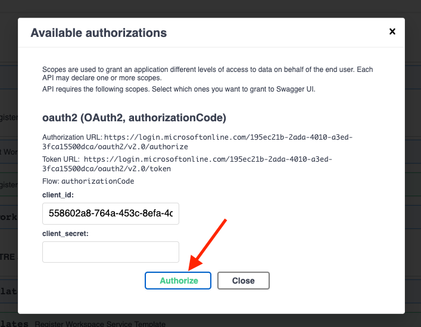

# TRE API

The TRE API is a service that users can interact with to request changes to workspaces e.g., to create, update, delete workspaces and workspace services inside each workspace.

This page is a guide for a developer looking to make a change to the API and debug it.

## Repository folder structure

```text
api_app
├── api              - API implementation
│   ├── dependencies - Dependencies for routes definition
│   ├── errors       - Definitions of error handlers
│   └── routes       - Web routes (API endpoints)
│
├── core             - Application configuration, startup events, logging
│
├── db               - Database related implementation
│   ├── migrations   - Manually written alembic migrations
│   └── repositories - All CRUD features
│
├── models           - Pydantic models for this application
│   ├── domain       - Main models that are used almost everywhere
│   └── schemas      - Schemas for using in web routes
│
├── resources        - Strings that are used e.g., in web responses
│
├── services         - Logic that is not only CRUD related (authentication, logging, tracing, etc)
│
├── tests_ma         - Unit tests
│
└── main.py          - FastAPI application creation and configuration
```

## Unit tests

The unit tests are written with pytest and located in folder `/api_app/tests_ma/`.

Run all unit tests with the following command in the root folder of the repository:

```cmd
pytest --ignore=e2e_tests
```

Please refer to a different [guide on running E2E tests locally](end-to-end-tests.md).

## Local debugging

To set up local debugging, first run (if you haven't done so already)

```cmd
az login
make setup-local-debugging
```

Next, go to "Run and Debug" panel in VSCode, and select TRE API.

[](../assets/api_local_debugging_vscode_screenshot.png)

You will see a log similar to this:

[](../assets/api_local_debugging_log.png)

Now, you should be able to open Swagger UI for your local instance on [http://localhost:8000/api/docs](http://localhost:8000/api/docs).

## Cloud instance

On Azure Portal, find an App Service instance named `app-${TRE_ID}`.

### API logs in LogAnalytics

To find logs in LogAnalytics, go to your resource group, then to LogAnalytics instance, which is named like `log-${TRE_ID}`.

There, you can run a query like

```cmd
AppTraces 
| where AppRoleName == "api"
| order by TimeGenerated desc 
```

### API logs using deployment center

Check that the version you are debugging/troubleshooting is the same one deployed on the App Service.

You can check this in Deployment Center, or follow the logs as generated by the container in the logs tabs.


### Deploying a cloud instance

To deploy a new version of the API to your TRE deployment, do this:

1. Update the version in `api_app/_version.py`

2. Run

```cmd
make build-and-push-api
make deploy-core
```

## Using Swagger UI

Swagger UI lets you send requests to the API.

To send a request, click on the row with the request, then `Try out`, then `Execute`. See screenshot:

[](../assets/api_swagger_send_request.png)

### Authorization

Swagger UI is accessible under `https://${TRE_ID}.${LOCATION}.cloudapp.azure.com/api/docs`.

To start using it, click Authorize button, then click Authorize (leave the field `client_secret` empty). See screenshot:

[](../assets/api_swagger_ui_authorize.png)


If you see an error message saying something like:

```text
The redirect URI 'https://tanyagts8.westeurope.cloudapp.azure.com/api/docs/oauth2-redirect' specified in the request does not match the redirect URIs configured for the application '558602a8-764a-453c-8efa-4dc3ddd61570'.
```

Then you'll need to update the redirect URI (see below).

Otherwise, after you sign in on Azure Portal, the lock icon on Authorize button should look "locked". Then you can start executing queries.

See also [setup instructions](../tre-admins/setup-instructions/deploying-azure-tre/#validate-the-deployment).

All workspace operations are executed using a different URL: `https://${TRE_ID}.${LOCATION}.cloudapp.azure.com/api/workspaces/${WORKSPACE_ID}/docs`. See also [instructions on installing base workspace](../tre-admins/setup-instructions/installing-base-workspace).

### Updating the redirect URI

If you get the following error:

[](../assets/api_swagger_ui_auth_error.png)

You should run:

```cmd
make auth
```

Alternatively, in Azure Portal you can add the redirect URL to the App Registration.
Under Microsoft Entra ID, find App Registrations, and find the App Registration with the ID shown in the error message.
There, go to Redirect URL and add the URL given to you by the error message (it will have a form of
`https://${TRE_ID}.westeurope.cloudapp.azure.com/api/docs/oauth2-redirect`).

## Troubleshooting

### Wrong docker image version

If this happens, you will see a log similar to this:

`2022-05-10T05:34:48.844Z ERROR - DockerApiException: Docker API responded with status code=NotFound, response={"message":"manifest for tborisdevtreacr.azurecr.io/microsoft/azuretre/api:0.2.24 not found: manifest unknown: manifest tagged by \"0.2.24\" is not found"}`

To fix, run `make build-and-push-api` from your branch and restart the instance.

### Investigating /api/health response

The endpoint `/api/health` tracks health of not only API, but other components of the system too, and can help to narrow down any problems with your deployment:

```json
{
  "services": [
    {
      "service": "Cosmos DB",
      "status": "OK",
      "message": ""
    },
    {
      "service": "Service Bus",
      "status": "OK",
      "message": ""
    },
    {
      "service": "Resource Processor",
      "status": "Not OK",
      "message": "Resource Processor is not responding"
    }
  ]
}
```

In this case, next step is to look at logs of Resource Processor. See also [Resource Processor docs](resource-processor.md).
