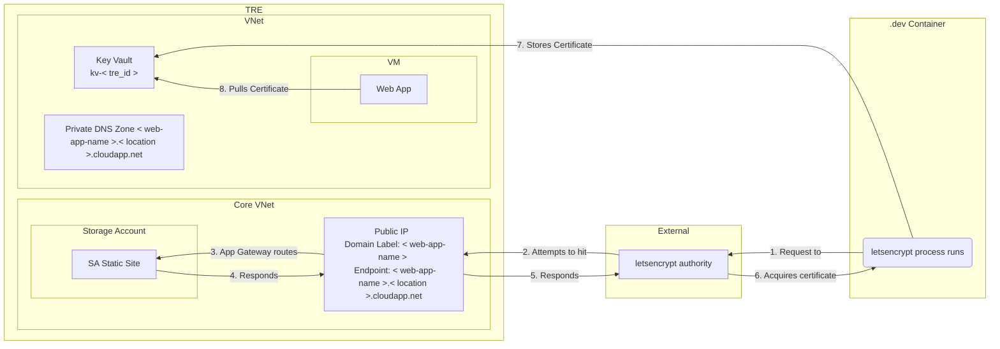

# Letsencrypt

Certain components of the TRE require the aquisition of a certificate via Letsencrypt to ensure secure HTTPS connections.

In order to aquire these certificates, there must be a public facing endpoint which can be reached by Letsencrypt.

As TREs are secured environments with very few publicly facing points, additional resources are required to ensure the certificate can be provisioned for the correct domain.

The additional resources are as followed:

1. Public IP provisioned in the same location as the web app that the certificate is intended for; this will also have a domain label which matches the web app name.
1. Storage Account with a static web app.
1. Application gateway to route traffic from the Public IP to the static web app

The following diagram illustrated the flow of data between the resources:

