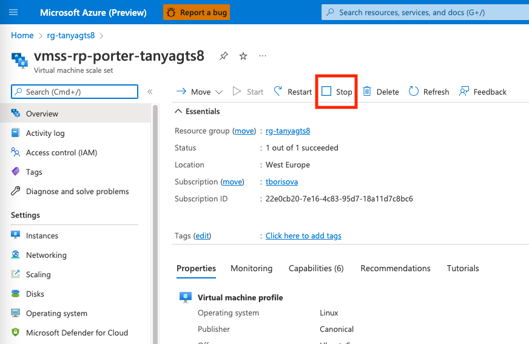
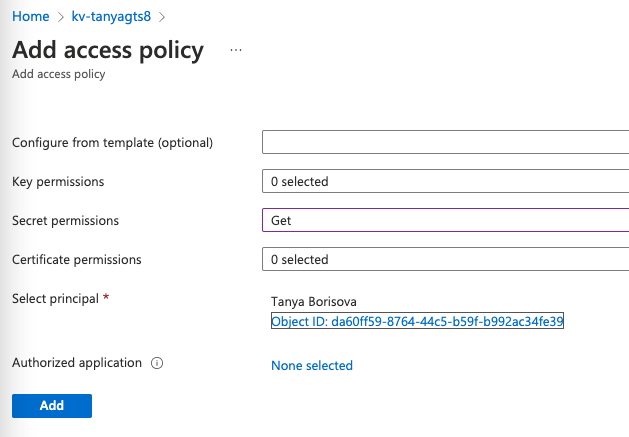

# Resource Processor (VMSS)

Resource Processor is the Azure TRE component automating [Porter](https://porter.sh) bundle deployments. It hosts Porter and its dependencies.

This page is a guide for a developer looking to make a change to the Resource Processor and debug it.

## Overview

The logic in Resource Processor is written in Python. The Resource Processor implementation is located in [`resource_processor` folder](https://github.com/microsoft/AzureTRE/blob/main/resource_processor/) of the repository.

Read [how a workspace is provisioned using Porter](./../azure-tre-overview/architecture.md#provisioning-a-workspace)

## Local debugging

To set up local debugging, first run, if you haven't done so already (make sure `ENABLE_LOCAL_DEBUGGING` is set to `true` in your `.env` file):

```cmd
az login
make setup-local-debugging
```

This will allowlist your local IP against Azure resources and create a Service Principal for the Resource Processor.

Next, disable the existing Resource Processor from running in your deployment. The easiest way to do this is to stop the VM scale set:

[](../assets/rp_stop_vm_scale_set.png)

Now, go to "Run and Debug" panel in VSCode, and select Resource Processor.

[](../assets/rp_local_debugging_vscode_screenshot.png)

!!! info
    If you get a credential error when trying to connect to Service Bus, make sure you've authenticated in the AZ CLI first as it uses your local credentials.

!!! info
    If you get an error similar to `Environment variable 'ARM_CLIENT_ID' is not set correctly`, make sure you have ran `make setup-local-debugging`

You can use an API instance deployed in your environment to create deployment requests, and debug your locally running Resource Processor.

For more information on how to use API, refer to [API documentation](./api.md#using-swagger-ui).

## Cloud instance

On Azure Portal, find an Virtual VM scale set with a name `vmss-rp-porter-${TRE_ID}`.

### Connect to the Resource Processor terminal

The processor runs in a VNET, and you cannot connect to it directly. To SSH to this instance, use Bastion.

1. Navigate to the VMSS instance named `vmss-rp-porter-${TRE_ID}` in the Azure Portal.
1. Click on `Instances` in the left menu.
1. Click on an instance name.
1. Click on `Connect -> Bastion` in the top menu.

  

1. Set `Authentication type` to `Password from Azure Key Vault`.
1. Set Username to `adminuser`.
1. Set the Key Vault to  `kv-${TRE_ID}` and Azure Key Vault Secret to `resource-processor-vmss-password`.

    If you don't have permissions to see the secret, add yourself to the Access Policy of this keyvault with a permission to read secrets:

    [](../assets/rp_kv_access_policy.png)

1. Click `Connect`.


### Getting container logs

1. SSH into the Resource Processor VM as described above
1. Check the status of the container using `docker ps`

    If you see nothing (and the container was pulled) then the processor has either not started yet or it has crashed.

1. Get the logs from the container using `docker logs <container_id>` command.

### Starting container manually

1. Find the **runner_image:tag** by running ``docker ps``
1. Execute the following command from the root (/) of the file system

  ```cmd
  sudo docker run -v /var/run/docker.sock:/var/run/docker.sock --env-file .env --name resource_processor_vmss_porter_debug [runner_image:tag]
  ```

!!! info
    If you start a container manually you will probably want to install software, for example, an editor. However, the firewall blocks all ingress traffic, so you cannot run `sudo apt update`. You need to add an override rule in the firewall to allow the traffic.

!!! caution
    Remember to remove this rule when debugging is done.

## Troubleshooting

### No container logs on the instance

1. If you don't see container logs, you should check the status of **cloud-init** which is used to bootstrap the machine with docker and start the processor. Log files for cloud init are:

   - `/var/log/cloud-init.log`
   - `/var/log/cloud-init-output.log`

   If the Docker container is pulled as shown in logs then the resource processor should start.
1. Check the status of all Docker processes using `docker ps -a` which should show you if the container terminated prematurely.

## Implementation details

### Porter

Azure TRE needed a solution for implementing and deploying workspaces and workspace services with the following properties:

* Means for packaging and versioning workspaces and workspace services
* Providing unified structure for deployment definitions (scripts, pipelines) so that the process can be easily automated
* Solid developer experience - easy to use and learn

Porter meets all these requirements well. Porter packages cloud application into a versioned, self-contained Docker container called a Porter bundle.

<!-- markdownlint-disable MD013 -->
CNAB spec defines actions that Porter [implements](https://porter.sh/author-bundles/#bundle-actions): **install, upgrade and uninstall**. The developer has practically complete freedom on how to implement logic for these actions. The deployment pipeline definition is created in YAML. The YAML file is called [Porter manifest](https://porter.sh/author-bundles/) and in additon to the actions, it contains the name, version, description of the bundle and defines the input parameters, possible credentials and output.

Furthermore, Porter provides a set of [mixins](https://porter.sh/mixins/) - analogous to the concrete actions in GitHub workflows and tasks in Azure DevOps pipelines - which simplify and reduce the development cost when implementing deployment logic. For example, Terraform mixin installs the required tools and provides a clean step in the pipeline to execute Terraform deployments. [Exec mixin](https://porter.sh/mixins/exec/) allows running any command or script; especially useful, if no suitable mixin for a specific technology is available. Implementing custom mixins is possible too.
<!-- markdownlint-enable MD013 -->

### Porter Azure plugin

Resource Processor uses [Porter Azure plugin](https://github.com/getporter/azure-plugins) to access secrets in Azure Key Vault.

### Porter bundle inputs

When Porter runs bundle actions, it passes input parameters. Full set of inputs that Porter passes can be found in [config.py](https://github.com/microsoft/AzureTRE/blob/main/resource_processor/shared/config.py).

!!! info
    Note that Resource Processor does not pass any location-related attributes when running bundle actions. Instead, a `location` attribute is passed from the API. This is so that different TRE resources could be potentially deployed to different regions.
