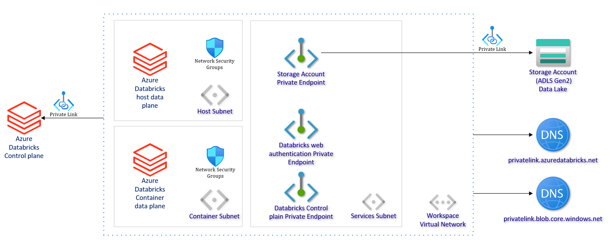

# Azure Databricks workspace service bundle

See: [https://azure.microsoft.com/en-us/products/databricks/](https://azure.microsoft.com/en-us/products/databricks/)

This service along with Azure Databricks Private Authentication Shared Service installs the following resources into an existing virtual network within the workspace:

This service uses a JSON file to store the various network endpoints required by Databricks to function.

If you hit networking related issues when deploying or using Databricks, please ensure this file [https://github.com/microsoft/AzureTRE/blob/main/templates/workspace_services/databricks/terraform/databricks-udr.json](https://github.com/microsoft/AzureTRE/blob/main/templates/workspace_services/databricks/terraform/databricks-udr.json) contains the approprate settings for the region you are using.

The required settings for each region can be extracted from this document: [https://learn.microsoft.com/azure/databricks/resources/supported-regions](https://learn.microsoft.com/azure/databricks/resources/supported-regions).

## Properties

- `is_exposed_externally` - If `True`, the Azure Databricks workspace is accessible from outside of the workspace virtual network. If `False` use a Guacamole VM and copy the `connection_uri` to access Databricks workspace.

## Prerequisites

- [A base workspace bundle installed](../workspaces/base.md)
- An Azure Databricks Private Authentication Shared Service deployed - required for authenticating to an Azure Databricks workspace.

## References

- Databricks workspace service and authentication shared service deployed according to simplified deployment, for more information see: [Enable Azure Private Link as a simplified deployment](https://learn.microsoft.com/en-us/azure/databricks/administration-guide/cloud-configurations/azure/private-link-simplified)
