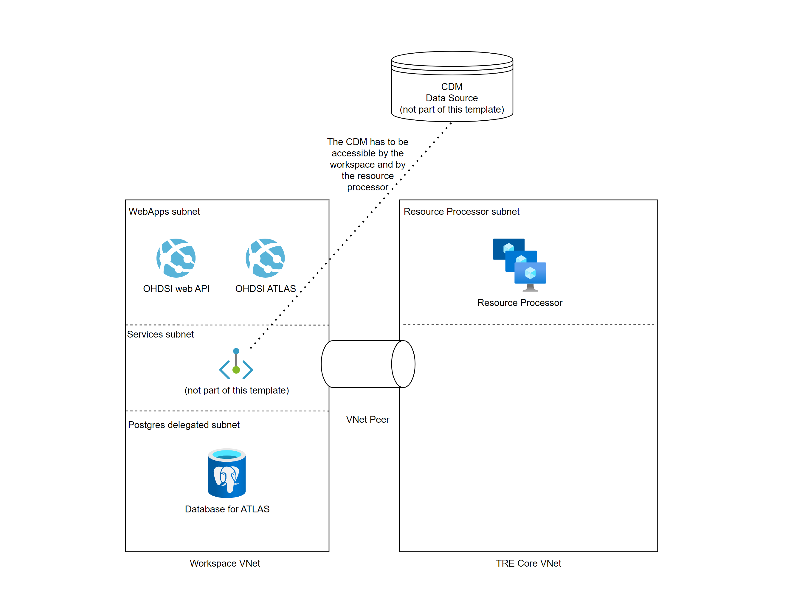

# OHDSI Workspace Service

!!! warning
    - This workspace service does not work "out of the box". It requires additional networking configuration to work properly. See the [networking configuration](#networking-configuration) section for more details.
    - Currently the only CDM data source supported by the workspace service is Azure Synapse.

See the [official OHDSI website](https://www.ohdsi.org/) and [The Book of OHDSI](https://ohdsi.github.io/TheBookOfOhdsi/).  

This service installs the following resources into an existing virtual network within the workspace:

## Networking configuration
Deploying the OHDSI workspace is not enough for it to function properly, in order for it to work properly, the following networking configuration should be in place:

### 1. The resource processor should be able to access the CDM data source
Multiple OHDSI workspace services cannot share the same RESULTS and TEMP schemas because each OHDSI instance is changing the schemas, which could potentially cause conflicts.
To avoid this, every workspace service must work on its own schemas. To do this, we use golden copying.
This means that the "main" schemas remain untouched, and every workspace service has its own copy of the RESULTS and TEMP schemas, in the CDM data source, which it can modify.

Since the resource processor is in charge of duplicating the schemas, the CDM data source has to be accessible from the resource processor's VNet in order to be able to create them.

### 2. The workspace should be able to access the CDM data source
In order to access the CDM from ATLAS, the CDM data source should be accessible from the workspace's VNet.
Since the CDM data source is outside of TRE, this is not part of the template, however, there are many ways in which this can be done,
one example would be to to deploy a private endpoint for the CDM data source in the workspace's VNet as part of a custom workspace template.

## Setting up a CDM data source
Currently the only CDM data source supported by the workspace service is Azure Synapse.  

If you already have an OMOP CDM data source, then all you have to do is to configure the network as described in the [networking configuration](#networking-configuration) section.  

If you're data is in a different format, you can read [here](https://ohdsi.github.io/TheBookOfOhdsi/ExtractTransformLoad.html) how to set up the ETL process to convert your medical data to OMOP format.  

## Using a sample CDM data source
If you don't have any data yet, or if you just want a quick start, you can deploy an Azure Synapse CDM data source with sample data using the [OHDSI on Azure](https://github.com/microsoft/OHDSIonAzure) repository.  
When deploying set `OMOP CDM Database Type` to `Synapse Dedicated Pool` as per the [deployment guide](https://github.com/microsoft/OHDSIonAzure/blob/main/docs/DeploymentGuide.md#:~:text=OMOP%20CDM%20Database%20Type).

Note that you will need to provision a private endpoint into the Azure TRE workspace that connects to the SQL Dedicated Pool as described in the [networking configuration](#networking-configuration) section.  
