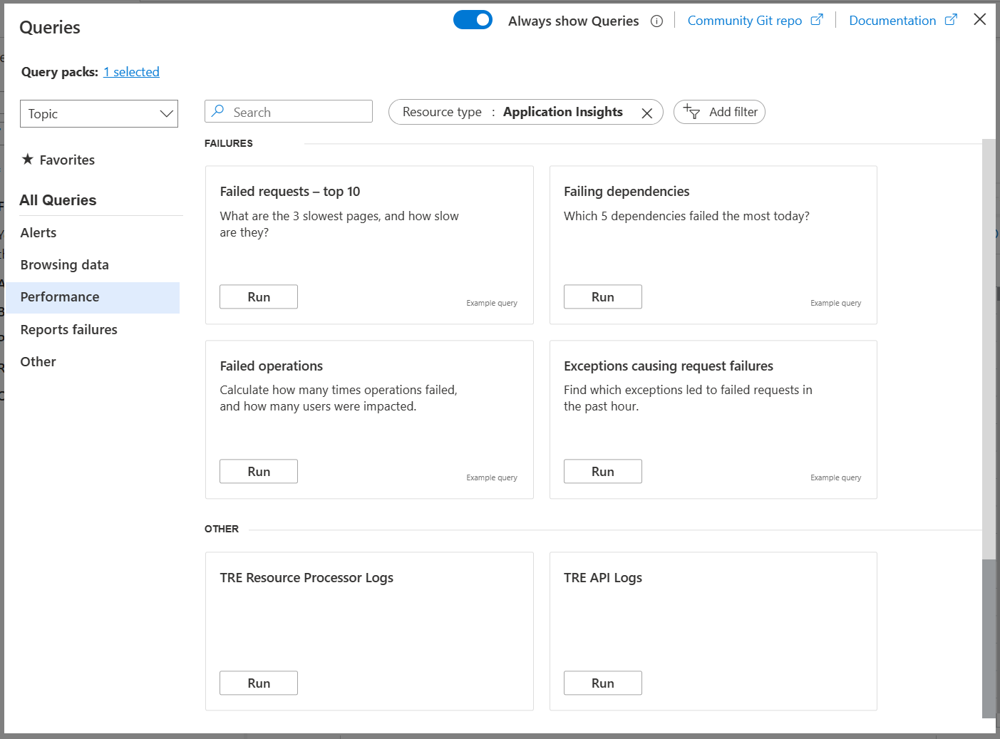
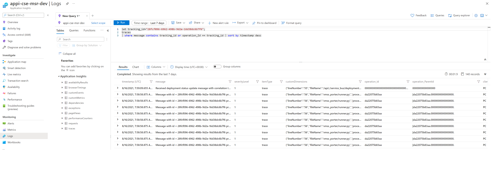

# Checking the logs in App Insights

Every component of TRE should send their trace logs to App Insights logging backend, and you should be able to see the process flow by using a suitable query.

!!! note
    AppTraces can take time to appear so be patient.

To find logs in Application Insights, go to your resource group, then to Application Insights instance, which is named like `appi-${TRE_ID}`. Click on *Logs* in the left menu. Under Queries, select either `TRE Resource Processor Logs` or `TRE API Logs`.



A manual query can also be created such as:

```kusto
traces 
| where cloud_RoleName == "resource_processor"
| order by timestamp desc 
```

## Check the logs for a specific deployment

You can run the following example query to get the logs for a specific deployment.

```kusto
let tracking_id="<workspace_id>";
AppTraces
| where Message has tracking_id or OperationId == tracking_id | sort by TimeGenerated desc
```

[](../assets/app_insights.png)

For a successful deployment you should see a message similiar to:

```text
Received deployment status update message with correlation ID 70b09db1-30c4-475c-b1a1-8f9599a5a2f4: {'id': '70b09db1-30c4-475c-b1a1-8f9599a5a2f4', 'status': 'deployed', 'message': 'cse-msr-dev-b7f6: Workspace was deployed successfully...'}
```

It should also be evident from the message flow where the current processing is stuck or failed. Failed deployment status should also be available in the `GET /api/workspaces/{workspace_id}` and this is just another way to confirm it.
