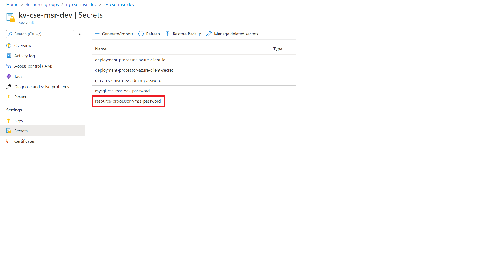
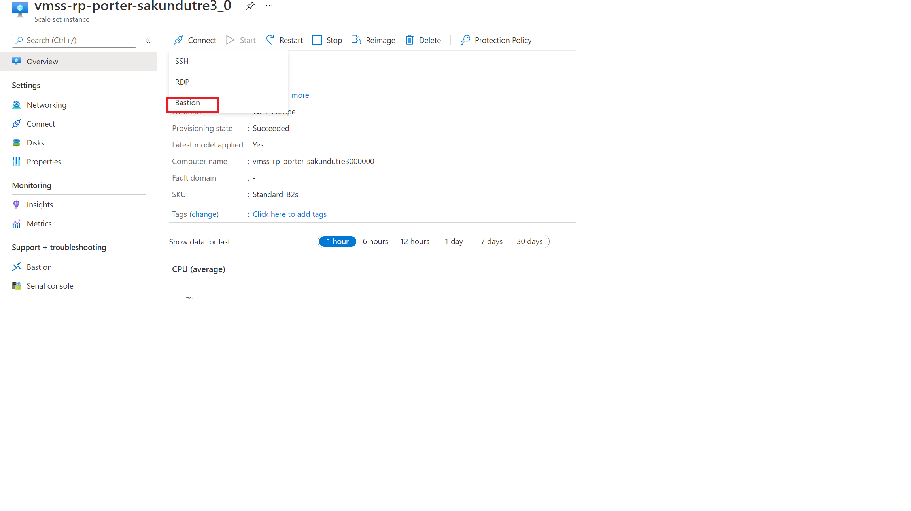

# Checking the Virtual Machine Scale Set (VMSS) instance running resource processor

If you see messages hanging in the service bus queue then the resource processor is not up and running.

Verify that the VMSS instance is up and healthy.


The processor runs in a VNET, and you cannot connect to it directly.

1. Connect to the instance using Bastion. Bastion is already deployed, and you can use the username `adminuser`. The password is stored in the keyvault under the secret `resource-processor-vmss-password`

  !!! info
      You cannot see secrets unless you are added to a suitable access policy for the Key Vault.

  

  

1. After logging in you should check the status of **cloud-init** which is used to bootstrap the machine with docker and start the processor. Log files for cloud init are:

   - `/var/log/cloud-init.log`
   - `/var/log/cloud-init-output.log`

   If the Docker container is pulled as shown in logs then the resource processor should start.

1. Check the status of the container using `docker ps`

  If you see nothing (and the container was pulled) then the processor has either not started yet or it has crashed.

1. Check the status of all Docker processes using `docker ps -a` which should show you if the container terminated prematurely.
1. Get the logs from the container using `docker logs <container_id>` command.

To start a processor container manually:

1. Find the **runner_image:tag** by running ``docker ps``
1. Execute the following command from the root (/) of the file system

  ```cmd
  docker run -v /var/run/docker.sock:/var/run/docker.sock --env-file .env --name resource_processor_vmss_porter_debug [runner_image:tag]
  ```

## Logs

All logs from the resource processor are transferred to the App Insights instance, so it is not usually necessary to follow the progress by logging into the instance.

Logging into the instance and starting a container manually however, is helpful in live debugging.
When doing so, you can use the following aliases to monitor progress:

* **rpstatus** - a split screen with `docker ps` to show what containers are running (a bundle action run in its own container), the Resource Processor logs, and a _free_ section for you to type any other command you wish (see below).
* **dlf** - runs `docker logs --since 1m --follow`, you should use with the name/id of the container you want to view, e.g. `dlf my_container`
* **dlf1** - same as `dlf` but will auto select the last container in the `docker ps` list (usually the last one started).

## Updating the running container

If you start a container manually you will probably want to install software, for example, an editor. However, the firewall blocks all ingress traffic, so you cannot run `sudo apt update`. You need to add an override rule in the firewall to allow the traffic.

!!! caution
    Remember to remove this rule when debugging is done.
