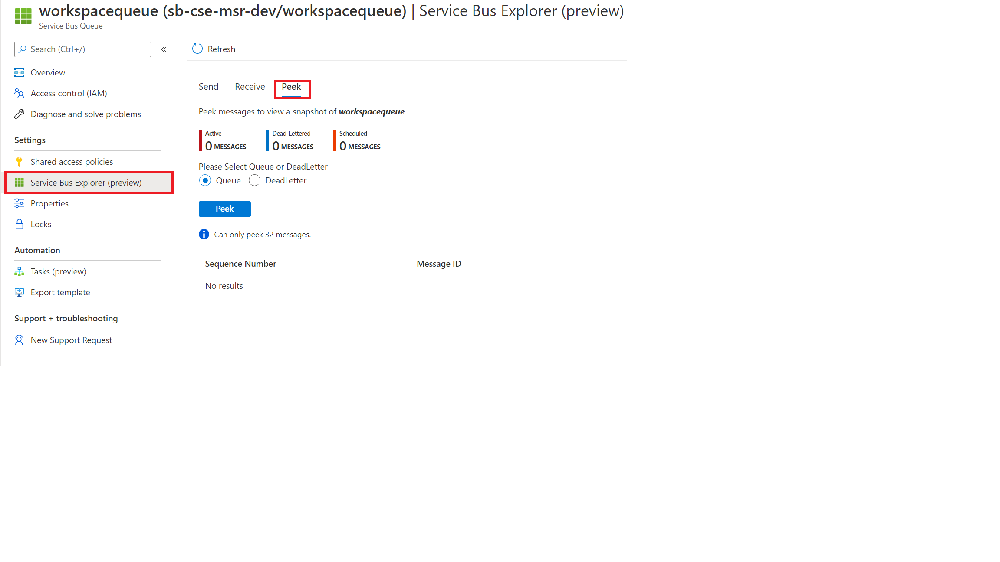

# Checking the Service Bus

If the message payload is accepted by the API, and a **workspace_id** is generated, you should be able to track the progress of the deployment using `GET /api/workspaces/{workspace_id}`

Initially the status is always reported as:

```json
{
  "deployment": {
    "status": "awaiting_deployment",
    "message": "This resource has not yet been deployed"
  }
}
```

This should eventually change as the message flows through the system.

If the message remains at this stage, you should first verify that the message arrived in the service bus.

In the Azure portal:

1. Select the Service Bus from deployed resources and click **Entities > Queues > workspacequeue**.
1. Select the Service Bus Explorer and the **Peek** tab to check for hanging messages.


