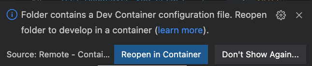

# Local Development

This guide will cover how to setup local development environment to add custom templates to AzureTRE and deploy AzureTRE from the local machine.

## Local Development Setup

### Prerequisites

To deploy an Azure TRE instance, the following assets and tools are required:

* [Azure subscription](https://azure.microsoft.com)
* [Microsoft Entra ID](https://learn.microsoft.com/en-gb/entra/fundamentals/whatis) tenant in which you can create application registrations
* Git client such as [Git](https://git-scm.com/) or [GitHub Desktop](https://desktop.github.com/)
* [Docker Desktop](https://www.docker.com/products/docker-desktop)

### Development container

The AzureTRE Deployment solution contains a [development container](https://code.visualstudio.com/docs/remote/containers) with all the required tooling to develop and deploy the AzureTRE and your custom templates to it. To deploy and extend an AzureTRE instance using the provided development container you will also need:

* [Visual Studio Code](https://code.visualstudio.com)
* [Remote containers extension for Visual Studio Code](https://marketplace.visualstudio.com/items?itemName=ms-vscode-remote.remote-containers)

The files in AzureTRE Deployment repo for the dev container are located in `/.devcontainer/` folder.

Having the prerequisites and the development container, to start local development follow the next steps:

1. Clone the project you have created from the AzureTRE Deployment template `git clone <your_project>`
1. Open it in Visual Studio Code
1. VSCode will recognize the devcontainer is set up in and will ask to reopen in Devcontainer:
    

After the devcontainer is built, you will see the AzureTRE folder which you can use as a reference for your templates. In addition the sample.env files will be added.
## Local Deployment

To run AzureTRE  deploy locally:

1. Open your project in VScode devcontainer.
2. Fill in all the required configuration. Follow [this guide](https://github.com/microsoft/AzureTRE-Deployment#congiguration-setup) to set it up.
3. run `make all`

!!! tip
    The Makefile in the AzureTRE deployment repository sources the make commands from AzureTRE that it references. This allows you to add your commands and also use the same make commands used in the AzureTRE.

Having all the env vars in place:

## How to Contribute to our Documentation

If you have any comments or suggestions about our documentation then you can visit our GitHub project and either raise a new issue, or comment on one of the existing ones.

You can find our existing documentation issues on GitHub by clicking on the link below:

[Existing Documentation Issues](https://github.com/microsoft/AzureTRE/issues?q=is%3Aissue+is%3Aopen+label%3Adocumentation)

Or, you can raise a new issue by clicking on this link:

[Report an Issue or Make a Suggestion](https://github.com/microsoft/AzureTRE/issues/new/choose)

**Thank you for your patience and support!**
