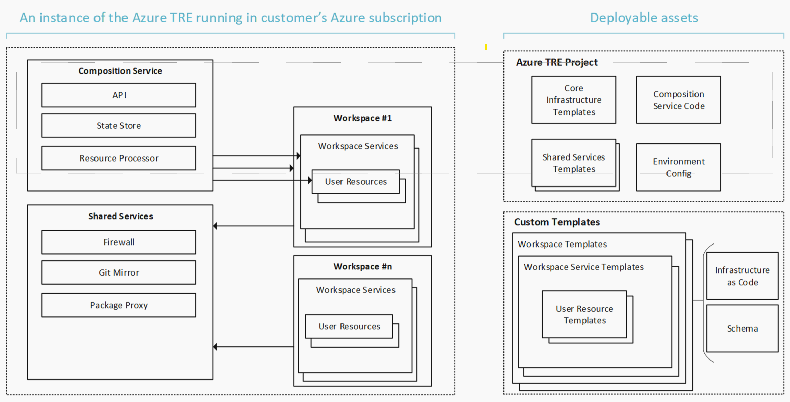

# Terms and Definitions

Trusted Research Environments (TRE) enforce a secure boundary around distinct workspaces to enable information governance controls to be enforced.

A Trusted Research Environment (typically one per organization, or one per department in large organizations) consist of:

- One **Composition Service** (API, deployment engine etc. used to manage and deploy workspaces, workspace services and user resources)
- One set of **Shared Services** used by all workspaces
- A number of **Workspaces**, where each workspace is its own security boundary, and in turn contains **Workspace Services** and User Resources

## The Composition Service

The Composition Service offers an abstraction over the lower-level Azure resources to allow for TRE users to provision resources in terms of workspaces and workspace services.

The Composition Service reconciles the desired state with the actual state by invoking Azure resource deployments.

The composition service is fronted by an API that helps the TRE Admin, TRE Workspace Owners and TRE Researchers create and manage the **workspaces** and **workspace services**.

## Shared Services

A service provides one or more capabilities to you as a user of the TRE or to the TRE itself.  Depending on the type of the service it is scoped to the environment and shared across all workspaces (Shared Service) or scoped to a specific workspace (Workspace Service).

The types of services required for a research project varies greatly why extensibility is a key aspect of the Azure TRE solution. New services can be developed by you and your organization to fit your needs.

**Shared Services** are services and resource shared by all workspaces. These services are created once, when the TRE is deployed and managed by the TRE Administrator.

Examples of shared services are:

- Firewall
- Package Mirror
- Git Mirror

## Workspace

A **workspace** is a set of resources on a network, with inbound traffic restricted to authorised users, and outbound access restricted to defined network locations.

The workspace is a security boundary and there should be zero transfer of data out from the workspace unless explicitly configured. Data transfer is not restricted within a workspace.

The workspace itself contains only the bare essentials to provide this functionality, such as virtual network(s), storage etc.

Workspaces can be enhanced with one or more building blocks called **workspace services** like Azure ML, Guacamole etc. to allow functionality such as development of machine learning models, data engineering, data analysis and software development.

Multiple workspaces can be created within a single Trusted Research Environment to enable the required separation for your projects.

Each workspace has [workspace users](../azure-tre-overview/user-roles.md): a **workspace owner** (normally only one), and one or more **workspace researchers** that can access the data and workspace services in the workspace. The workspace owner is also considered a workspace researcher.

!!! important
    The TRE has a soft limit of 32 projects, it can be increased to 70 by updating the storage account limit in your subscription to 500.
    See issue [#3920](https://github.com/microsoft/AzureTRE/issues/3920) for more info.

## Workspace Service

A workspace service is a service, created as a building block, with pre-configured set of resources that can be applied to a workspace.

Examples of Workspace Services are:

- Guacamole (Virtual Desktops)
- Azure Machine Learning

Unlike shared services, a workspace service is only accessible to the workspace users.

Some workspace services, such as Guacamole, allow users to add on user-specific resources (user resources)

All workspace services can be deployed to all workspaces.

## User Resource

A user resource is a resource that is only available to a particular researcher. For example a virtual machine exposed by Guacamole.

User resources can be deployed to workspaces with a compatible workspace service. E.g. Guacamole VMs can only be deployed to workspaces where the Guacamole workspace service is deployed.

## Templates

In order to deploy resources (workspaces, workspace services, user resources), the resources have to be defined in templates.

A template contains everything needed to create an instance of the resource. Ex. a base workspace template, or a Guacamole workspace service template.

The templates describe the porter bundles used, and the input parameters needed to deploy them.

To use a template, and deploy a resource, the template needs to be registered in the TRE. This is done using the TRE API.

!!! tip
    Once a template is registered it can be used multiple times to deploy multiple workspaces, workspace services etc.

If you want to author your own workspace, workspace service, or user resource template, consult the [template authoring guide](../tre-workspace-authors/authoring-workspace-templates.md)
