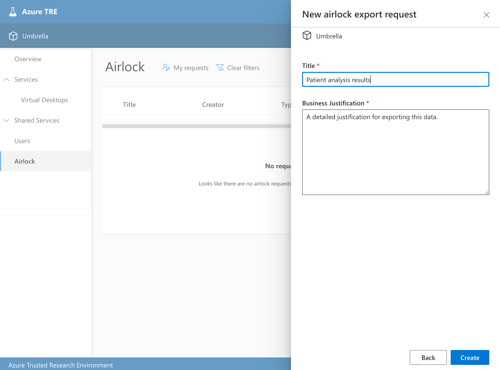
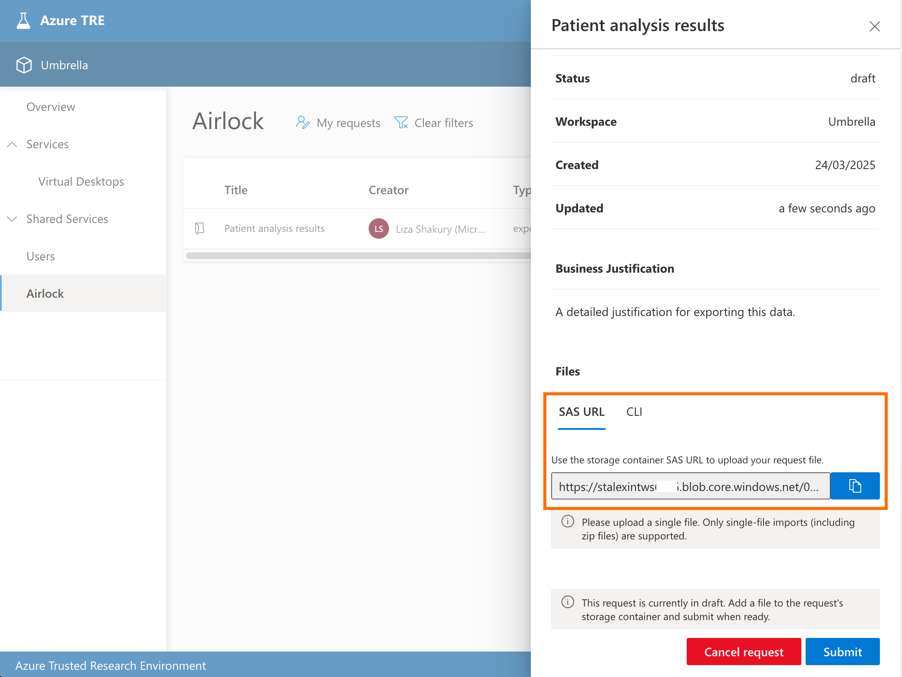
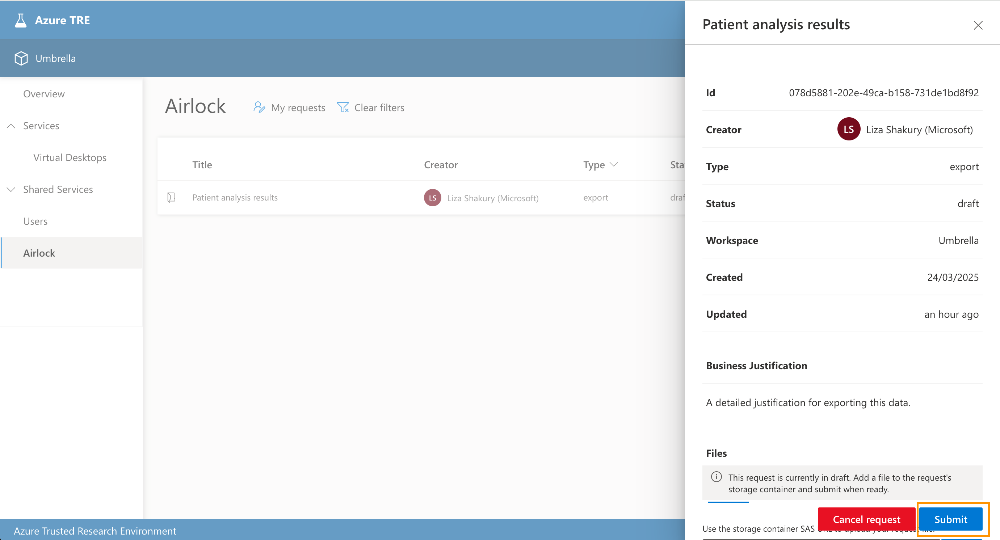
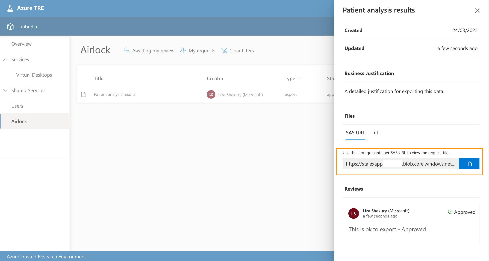

# Importing and exporting data with Airlock

This guide will take you through the process of importing data into a TRE workspace, and exporting data from a workspace to the outside world, using the Airlock feature.

The Airlock feature is intended for ad-hoc use when you need to bring in and export out files that you need for your research. It ensures that when you import or export this data all the appropriate approvals and procedures configured by your organisation take place.

You can read more about the Airlock feature in the [Airlock documentation](../../azure-tre-overview/airlock.md).

## Importing data to a workspace

To bring in external data to a secure TRE workspace so you can use it for your research, follow the steps outlined below.

### Step 1: Create a draft import request

1. Open your TRE UI and navigate to the workspace you wish to import data into

1. Navigate to the Airlock tab (in the left-hand menu)

1. Click *Create new* and select *Import*

1. Fill in a suitable **Title** for your request (make this short but descriptive to help you and others identify it in a list of many other requests)

1. Provide a **Business Justification** for bringing the data into the workspace (this will be used to help your organisation's data stewards decide whether to approve or reject the request)

1. Click *Create* when ready. This will create your draft request and allow you to proceed with adding the data you'd like to import

### Step 2: Add data to your import request

1. The request you've just created should pop up automatically; however, you can return to it at any time within the Airlock page by finding it in the list of requests. (Use the *My requests* quick filter to find it more easily)

2. Click *Generate* in the **Files** section to generate a Storage SAS URL to use for uploading your data.

3. Copy the URL and use it to upload your data to the Azure Storage account. You can use several tools for this that accept SAS URLs, such as the Azure Storage Explorer, or the Azure CLI, depending on your preference.

   - To use Storage Explorer, follow [this guide](https://learn.microsoft.com/en-us/azure/storage/storage-explorer/vs-azure-tools-storage-manage-with-storage-explorer?tabs=macos#shared-access-signature-sas-url) to connect to container.

   - With the Azure CLI, you can run `az storage blob upload -f /path/to/file --blob-url SAS_URL`. [More info](https://learn.microsoft.com/en-us/cli/azure/storage/blob?view=azure-cli-latest#az-storage-blob-upload)

!!! warning
    Airlock only supports a single file per request. If you need to import multiple files, please zip them before uploading to the request's storage container.

4. Once you've uploaded your data, head back to the TRE UI and click *Submit* on your draft request. This will submit your request for approval.

### Step 3: Get your approved data

The request will be in an *In Review* state until it is either approved or rejected by your Airlock Manager(s) manually or by an automated workflow (depending on your organisation's specific configuration).

!!! note
    Your organisation may have the Airlock Notifier service configured which will send email notifications when your request has been approved/rejected, or you may have another mechanism in place. Please check with your TRE administrator to see which mechanism are you using to send notifications.

If the request is rejected, your data will be deleted and your request will move into a *Rejected* state. You will be able to see feedback in the **Reviews** section on why your request was rejected so you can create a new request that addresses any concerns.

If your request is approved, you can follow the below steps to get your data from within your workspace:

1. Head back to your Airlock request in the TRE UI. You should find that it is now in an *Approved* state and ready for you to get your data. You can also see the notes from the reviewer in the **Reviews** section.

2. Click *Generate* in the **Files** section to generate another Storage SAS URL which you'll use for downloading your data.

3. Paste this link into your Workspace VM (or whichever workspace resource you're wanting to access the data from). Like before, use your preferred tool to access the data using the SAS URL, but this time to download the data.

   - With the Azure CLI, you can use `az storage blob download --file /path/to/write/to --blob-url SAS_URL`. [More info](https://docs.microsoft.com/en-us/cli/azure/storage/blob?view=azure-cli-latest#az-storage-blob-download)

!!! tip
    If you are using a Workspace VM that uses one of the standard TRE Data Science VM images, you will likely have both Storage Explorer and the Azure CLI pre-installed.

## Exporting data from a workspace

Exporting data from a secure TRE workspace to the outside world involves similar steps to Import, but with a couple of key differences. Follow these steps:

1. Open your TRE UI and navigate to the workspace you wish to export data from

2. Navigate to the Airlock tab (in the left-hand menu) and click *Create new*, then select *Export*

3. Fill in a suitable **Title** and **Business Justification** for the request then hit *Create*

4. Once the draft request pop-out opens, click *Generate* in the **Files** section to generate a Storage SAS URL to use for uploading your data.

5. Since this is an export, this means the data is exported from the workspace outside. Therefore, to upload the requested export file, you will now need to head into your *Workspace VM/resource* containing the data you wish to export.
Use your preferred storage tool to upload the data to the request container and paste in the SAS URL you've just generated. See Step 2 in the [Importing data](#importing-data-to-a-workspace) section for more details on using these tools.

6. Once you've uploaded your data, head back to the TRE UI in your host and click *Submit* on your draft request. This will submit your request for approval.

7. Like in Step 3 of [Importing data](#importing-data-to-a-workspace), your request will be in an *In Review* state until it's either approved or rejected by your organisation's approval workflow.

8. Once it's approved, head back to your request in the UI and click *Generate* a second time to get a download link.

9. In your host (outside of the workspace), you can use this link with your tool of choice to download the data from the request container.

## How to Contribute to our Documentation
[Contribute to Documentation](https://microsoft.github.io/AzureTRE/latest/contributing/)
