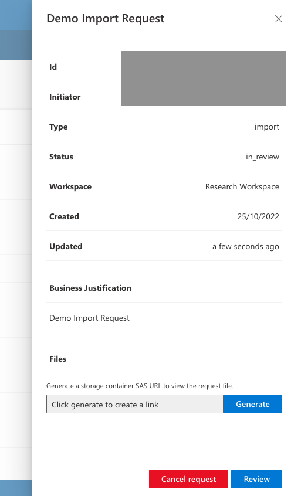
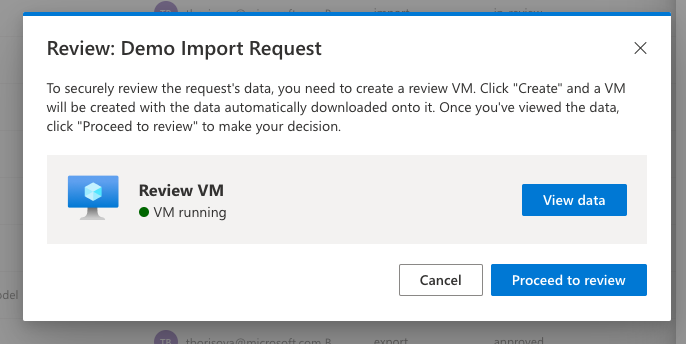
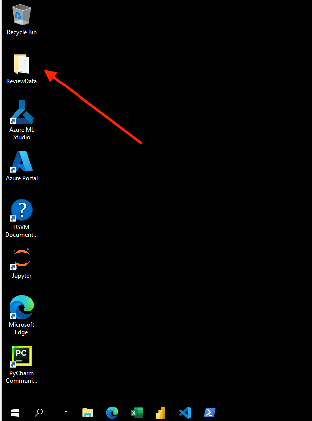

# Reviewing Airlock Requests

This document is intended for a user assuming the Airlock Manager role in the workspace.
It explains how to review Airlock Requests, both for data import and data export.

## Accessing Airlock Requests

Airlock Requests page can be found under Airlock menu for the relevant workspace.
The view allows to select requests "Awaiting my review" to quickly get to requests that need to be reviewed for this workspace. Other filters are also available by clicking on the column name.

Only requests that are in `in_review` state can be reviewed.

## Reviewing a request

> The following steps are the same for import and export request types.

Request page is available by double-clicking on one of the requests.
This gives an overview of the request, including information on who created the request, the title and business justification of the request, when it was created, in what workspace, and type of the request (import or export).

Reviewing menu is available by clicking on Review button at the bottom.

This screen offers an option to create a VM from which the imported or exported data can be reviewed. To create a VM, click on "Create" button. The display will show that the VM is "Awaiting Deployment", and then "Deploying".

After several minutes, the display will show that the VM is "Running", and a "View Data" button will become available. When it's clicked, a Guacamole session is opened in a new tab.

On the VM, the data to review will be readily available on Desktop, in ReviewData folder.

Back on the request display on the UI, there is a button "Proceed to review" which will show a dialogue for providing an explanation for the request decision. It must be filled in before the request can be either approved or rejected.

After the decision is submitted, TRE will automatically start deletion of the VM that was created to review this request.
