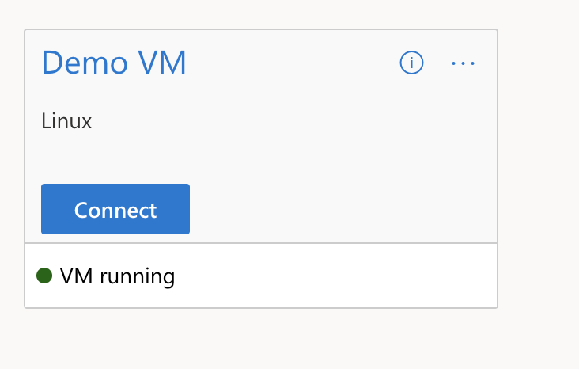

# Set up of a Virtual Machine
This document will talk you through how to deploy a Virtual Machine via the Guacamole Workspace Service and access imported data.

## Creating your VM

1. Open the UI link `https://<TRE_ID>.<LOCATION>.cloudapp.azure.com/`

   1. You will need the Microsoft Authenticator app on your phone. The above will take you through the set up process.

2. Within the UI, under the Workspaces tab you should be able to see any Workspaces assigned to you.

3. Click on the title of the Workspace to go into it. Within there should be the Guacamole Workspace Service, click the title to go into the Workspace Service.

   1. Clicking Connect will take you to the Guacamole Home Page where it will list out all of your deployed VMs.

4. Within the Workspace Service tab, you’ll need to choose Create new to create a user resource. This will be your VM.

5. Choose the template you’d like to base your VM on, at the moment the choice will be between a Windows or Linux VM.

   1. Fill in all of the details to your requirements.

6. Once the resource is deployed, you should be able to choose Connect and view your VM in a browser.

*You may see a pop-up asking for guacamole to have permission to use your clipboard, please allow that.*

## Accessing Data
At this stage you may want to access any data that has been approved via the Airlock mechanism.

To do this, copy the Generated URL from the UI and navigate to the Storage Explorer application within the VM.

1. Connect to the Storage account using the container URL from the previous step.
   1. Open storage explorer
   2. Right click on Storage Accounts and choose Connect to Azure Storage
   3. Choose Blob Container
   4. Select Shared access Signature URL (SAS)
   5. Paste in the Container URL
   6. Connect

2. Download any files to the VM to a destination of your choice. No other researchers can access this VM so feel free to save it where ever you'd like.
   1. To unzip the files in Windows > Right click and Extract all.
   2. To unzip the files in Linux > run unzip /folder_location.zip

## Starting and Stopping your VM
When you are no longer using a VM, it is good practice to stop it so that the VM is deallocated and no unnecessary costs will be applied.
To do this, navigate to the UI and find your VM.

1. Click on the three small dots in the top right of the user resource card and choose Actions and then Stop.
2. It will take a few minutes to take effect and the card should then display 'VM deallocated'.

The same steps can be followed to Start your VM.

## Deleting your VM
If you no longer wish to use the VM you have created there is an option to delete it. First you'll need to disable the VM, similar to above when stopping it:

1. Click on the three small dots in the top right and choose Disable.
2. Once it is disabled (this can take a few minutes), click on the three dots again and you should then have the option to delete it.

## How to Contribute to our Documentation
If you have any comments or suggestions about our documentation then you can visit our GitHub project and either raise a new issue, or comment on one of the existing ones.
You can find our existing documentation issues on GitHub by clicking on the link below:
[Existing Documentation Issues](https://github.com/microsoft/AzureTRE/issues?q=is%3Aissue+is%3Aopen+label%3Adocumentation)
Or, you can raise a new issue by clicking on this link:
[Report an Issue or Make a Suggestion](https://github.com/microsoft/AzureTRE/issues/new/choose)
**Thank you for your patience and support!**
